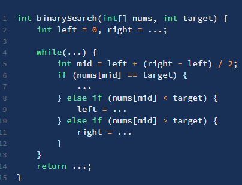

### 使用二分的条件

1. 单调的
2. 有上下界
3. 可通过索引访问其中的元素(可选)

### framework

**很多人喜欢拿整型溢出的 bug 说事儿，但是二分查找真正的坑根本就不是那个细节问题，而是在于到底要给 mid 加一还是减一，while 里到底用 <= 还是 <**



> 1. 分析二分查找代码时，最好不要出现 else，全部展开成 else if 方便理解
> 2. 注意「搜索区间」和 while 的终止条件，如果存在漏掉的元素，记得在最后检查
> 3. 如需定义左闭右开的「搜索区间」搜索左右边界，只要在 `nums[mid] == target` 时做修改即可，搜索右侧时需要减一
> 4. 如果将「搜索区间」全都统一成两端都闭，好记，只要稍改 `nums[mid] == target` 条件处的代码和返回的逻辑即可

### some templates

#### basic template

```javascript {.line-numbers}
const binarySearch = (arr, target) => {
	if (arr.length === 0) return arr - 1
	let left = 0,
		right = arr.length - 1, //Note!!!
		mid
	//Note!!!
	while (left <= right) {
		// mid = left + (right - left) / 2
		// mid = left + (right - left) >> 2
		mid = Math.floor(left + (right - left) / 2)
		if (arr[mid] < target) {
			left = mid + 1 //Note!!!
		} else if (arr[mid] > target) {
			right = mid - 1 //Note!!!
		} else if (arr[mid] === target) {
			return mid
		}
	}
	return -1
}
```

#### 查找第一个值等于给定值的元素

```javascript {.line-numbers}
const binarySearch = (arr, target) => {
	if (arr.length === 0) return arr - 1
	let left = 0,
		right = arr.length - 1,
		mid
	while (left <= right) {
		mid = Math.floor(left + (right - left) / 2)
		if (arr[mid] < target) {
			right = mid - 1
		} else if (arr[mid] > target) {
			left = mid + 1
		} else {
			//已经到第一个或者已经找到
			if (mid === 0 || arr[mid - 1] !== target) {
				return mid
				//继续收缩右边界
			} else {
				right = mid - 1
			}
		}
	}
	return -1
}
```

#### 查找最后一个值等于给定值的元素

```javascript {.line-numbers}
const binarySearch = (arr, target) => {
	if (arr.length === 0) return arr - 1
	let left = 0,
		right = arr.length - 1,
		mid
	while (left <= right) {
		mid = Math.floor(left + (right - left) / 2)
		if (arr[mid] < target) {
			right = mid - 1
		} else if (arr[mid] > target) {
			left = mid + 1
		} else {
			if (mid === arr.length - 1 || arr[mid + 1] !== target) {
				return mid
			} else {
				left = mid + 1
			}
		}
	}
	return -1
}
```

#### 查找第一个大于等于给定值的元素

```javascript {.line-numbers}
const binarySearch = (arr, target) => {
	let left = 0,
		right = arr.length - 1,
		mid
	while (left <= right) {
		mid = Math.floor(left + (right - left) / 2)
		if (arr[mid] >= target) {
			if (mid === 0 || arr[mid - 1] < target) {
				return mid
			} else {
				right = mid - 1
			}
		} else {
			left = mid + 1
		}
	}
	return -1
}
```

#### 查找最后一个小于等于给定值的元素

```javascript {.line-numbers}
const binarySearch = (arr, target) => {
	let left = 0,
		right = arr.length - 1,
		mid
	while (left <= right) {
		mid = Math.floor(left + (right - left) / 2)
		if (arr[mid] <= target) {
			if (mid === arr.length - 1 || arr[mid + 1] > target) {
				return mid
			} else {
				left = mid + 1
			}
		} else {
			right = mid - 1
		}
	}
	return -1
}
```

#### 寻找左侧边界的二分搜索

```javascript {.line-numbers}
const leftBound = (arr, target) => {
	let left = 0,
		right = arr.length - 1
	// 搜索区间为 [left, right]
	while (left <= right) {
		let mid = Math.floor(left + (right - left) / 2)
		if (arr[mid] < target) {
			// 搜索区间变为 [mid+1, right]
			left = mid + 1
		} else if (arr[mid] > target) {
			// 搜索区间变为 [left, mid-1]
			right = mid - 1
		} else if (arr[mid] === target) {
			// 收缩右侧边界
			right = mid - 1
		}
	}
	// 检查出界情况
	if (left >= arr.length || arr[left] !== target) return -1
	return left
}
```

#### 寻找右侧边界的二分搜索

```javascript {.line-numbers}
const rightBound = (arr, target) => {
	let left = 0,
		right = arr.length - 1
	// 搜索区间为 [left, right]
	while (left <= right) {
		let mid = Math.floor(left + (right - left) / 2)
		if (arr[mid] < target) {
			// 搜索区间变为 [mid+1, right]
			left = mid + 1
		} else if (arr[mid] > target) {
			// 搜索区间变为 [left, mid-1]
			right = mid - 1
		} else if (arr[mid] === target) {
			// 收缩右侧边界
			left = mid + 1
		}
	}
	// 检查出界情况
	if (right < 0 || arr[right] !== target) return -1
	return right
}
```
