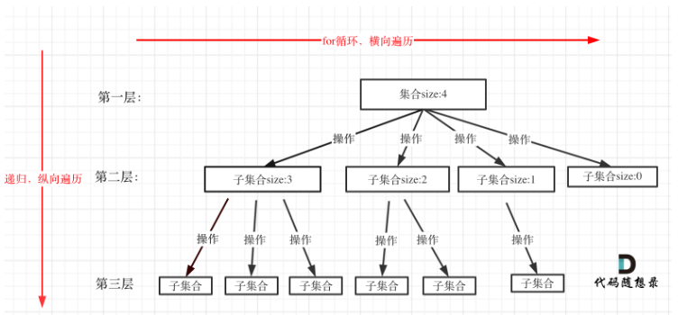
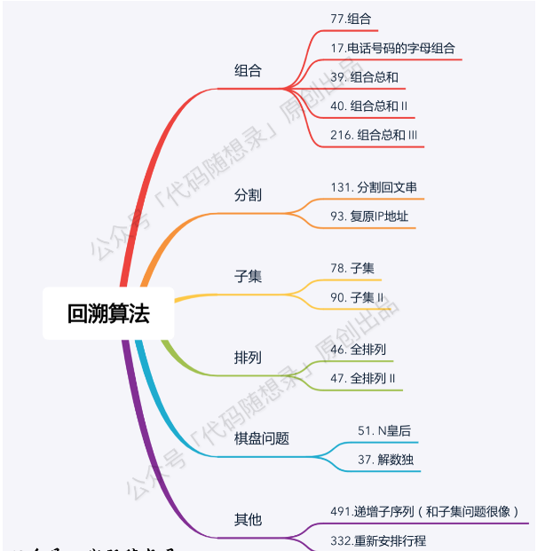

## concept

- **回溯法解决的问题都可以抽象为树形结构**

- **集合的大小就构成了树的宽度，递归的深度，都构成的树的深度**

  

- **一般来说：组合问题和排列问题是在树形结构的叶子节点上收集结果，而子集问题就是取树上所有节点的结果**

## questions



### [17.==电话号码的字母组合==](https://leetcode-cn.com/problems/letter-combinations-of-a-phone-number/)

```javascript
var letterCombinations = function (digits) {
	let ret = []
	if (!digits) return ret
	const hash = {
		2: 'abc',
		3: 'def',
		4: 'ghi',
		5: 'jkl',
		6: 'mno',
		7: 'pqrs',
		8: 'tuv',
		9: 'wxyz',
	}
	const dfs = (s, level) => {
		if (level === digits.length) {
			ret.push(s)
			return
		}
		for (let c of hash[digits[level]]) {
			//字符串省略回溯
			dfs(s + c, level + 1)
		}
	}
	//can pass more params if needed, like ret、hash、digits
	dfs('', 0)
	return ret
}
```

### [22.==括号生成==](https://leetcode-cn.com/problems/generate-parentheses/)

```javascript
//brute force
var generateParenthesis = function (n) {
	const ret = []
	const isValid = (s) => {
		let balance = 0
		for (let c of s) {
			if (c === '(') {
				balance++
			} else {
				balance--
			}
			//提前返回
			if (balance < 0) return false
		}
		return balance === 0
	}
	const dfs = (level, max, s) => {
		//1 recursion terminal
		if (level >= max) {
			if (isValid(s)) ret.push(s)
			return
		}
		//2 process logic of current level
		//3 drill down
		dfs(level + 1, max, `${s}(`)
		dfs(level + 1, max, `${s})`)
		//4 reverse current params if needed
	}
	//level, maxCount, pathStr
	dfs(0, 2 * n, '')
	return ret
}

//回溯 better
var generateParenthesis = function (n) {
	const ret = []
	const dfs = (l, r, max, s) => {
		if (l === max && r === max) {
			ret.push(s)
			return
		}
		//回溯的过程中直接剪枝掉无效的组合
		if (l < n) dfs(l + 1, r, max, s + '(')
		//回溯的过程中直接剪枝掉无效的组合
		if (l > r) dfs(l, r + 1, max, s + ')')
	}
	//pass ret if needed
	dfs(0, 0, n, '')
	return ret
}
```

### [36.有效的数独](https://leetcode-cn.com/problems/valid-sudoku/)

```javascript
var isValidSudoku = function (board) {
	const rows = {}, //记录每行数字
		columns = {}, //记录每列数字
		boxes = {} //记录每个小数独对应的key
	for (let i = 0; i < 9; i++) {
		for (let j = 0; j < 9; j++) {
			const num = board[i][j]
			if (num !== '.') {
				//计算子数独序号0 - 8
				const boxIdx = Number.parseInt(i / 3) * 3 + Number.parseInt(j / 3)
				if (
					rows[i + '-' + num] ||
					columns[j + '-' + num] ||
					boxes[boxIdx + '-' + num]
				)
					return false
				rows[i + '-' + num] = true
				columns[j + '-' + num] = true
				boxes[boxIdx + '-' + num] = true
			}
		}
	}
	return true
}
```

### [77.==组合==](https://leetcode-cn.com/problems/combinations/)

```javascript {.line-numbers}
//dfs + backtrack 1
//best version
var combine = function (n, k) {
	let ret = []
	const dfs = (startIdx, path) => {
		if (path.length === k) {
			ret.push([...path])
			return
		}
		//剪枝：待组成的数凑不够k个
		for (let i = startIdx; i <= n - (k - path.length) + 1; i++) {
			//dfs(i + 1, [...path, i])
			path.push(i)
			dfs(i + 1, path)
			//backtrack [1,2...] -> [1,3...] -> [2...]
			path.pop()
		}
	}
	//can pass n、k if you want
	dfs(1, [])
	return ret
}

//dfs + backtrack 2
var combine = function (n, k) {
	const ret = []
	const dfs = (cur, n, k, path) => {
		//剪枝,当前选择个数 + 剩下的待选数不够k个
		if (path.length + (n - cur + 1) < k) return
		if (path.length === k) {
			ret.push(path)
			return
		}
		//选择当前数字
		dfs(cur + 1, n, k, [...path, cur])
		//不选当前数字
		dfs(cur + 1, n, k, path)
	}
	dfs(1, n, k, [])
	return ret
}
```

### [39.==组合总和==](https://leetcode-cn.com/problems/combination-sum/)

```javascript {.line-numbers}
//candidates无重复
//dfs + backtrack 1
var combinationSum = function (candidates, target) {
	const len = candidates.length,
		ret = []
	if (len === 0) return ret
	const dfs = (candidates, remain, startIdx, path) => {
		if (remain < 0) return
		if (remain === 0) {
			ret.push([...path])
			return
		}
		for (let i = startIdx; i < candidates.length; i++) {
			path.push(candidates[i])
			//可重复选元素
			dfs(candidates, remain - candidates[i], i, path)
			//backtrack
			path.pop()
		}
	}
	dfs(candidates, target, 0, [])
	return ret
}

//dfs + backtrack 2
var combinationSum = function (candidates, target) {
	const len = candidates.length,
		ret = []
	if (len === 0) return ret
	const dfs = (candidates, remain, start, path) => {
		//[2,3,6,7], 7,已选[2,2,2]
		if (remain < 0 || start >= candidates.length) return
		if (remain === 0) {
			ret.push(path)
			return
		}
		//choice
		//剪枝
		if (remain - candidates[start] >= 0) {
			dfs(candidates, remain - candidates[start], start, [
				...path,
				candidates[start],
			])
		}
		//no choice
		dfs(candidates, remain, start + 1, path)
	}
	dfs(candidates, target, 0, [])
	return ret
}
```

### [40.组合总和 II](https://leetcode-cn.com/problems/combination-sum-ii/)

```javascript {.line-numbers}
//candidates有重复
var combinationSum2 = function (candidates, target) {
	const len = candidates.length,
		ret = []
	if (len === 0) return ret
	//precondition!!!!!!!
	candidates.sort((a, b) => a - b)
	const dfs = (candidates, remain, startIdx, path) => {
		if (remain === 0) {
			ret.push([...path])
			return
		}
		for (let i = startIdx, len = candidates.length; i < len; i++) {
			//大剪枝:减去candidates[i]小于 0，减去后面的candidates[i + 1]、candidates[i + 2]肯定也小于 0
			if (remain - candidates[i] < 0) break
			//小剪枝:对同层使用过相同数值的元素跳过
			if (i > startIdx && candidates[i - 1] === candidates[i]) continue
			path.push(candidates[i])
			dfs(candidates, remain - candidates[i], i + 1, path)
			path.pop()
		}
	}
	dfs(candidates, target, 0, [])
	return ret
}
```

### [46.==全排列 M==](https://leetcode-cn.com/problems/permutations/)

```javascript {.line-numbers}
//nums无重复
//dfs + backtrack
var permute = function (nums) {
	const len = nums.length
	if (len === 0) return ret
	let ret = [],
		//space for time
		visited = Array.from({ length: len }, () => false)
	const dfs = (level, path) => {
		if (level >= nums.length) {
			ret.push([...path])
			return
		}
		//每层都从开头枚,visited标记是否上层选过
		for (let i = 0; i < nums.length; i++) {
			if (visited[i]) continue
			path.push(nums[i])
			visited[i] = true
			dfs(level + 1, path)
			//backtrack
			visited[i] = false
			path.pop()
		}
	}
  //函数签名可以是dfs(nums, []), terminate是path.length >= nums.length
	dfs(0, [])
	return ret
}

//swap方法 省空间
var Solution = function () {
	this.result = []
	this.permute = function (nums) {
		this.backtrack(nums, 0)
		return this.result
	}
	this.backtrack = function (nums, start) {
		if (start === nums.length) {
			var list = []
			for (var num of nums) list.push(num)
			this.result.push(list)
			return
		}
		for (var i = start; i < nums.length; i++) {
			// 做选择
			this.swap(nums, start, i)
			// 递归调用，传入 start + 1
			this.backtrack(nums, start + 1)
			// 撤销选择
			this.swap(nums, start, i)
		}
	}
	this.swap = function (nums, i, j) {
		var temp = nums[i]
		nums[i] = nums[j]
		nums[j] = temp
	}
}
```

### [47.全排列 2 M](https://leetcode-cn.com/problems/permutations-ii/)

```javascript {.line-numbers}
//nums有重复
var permuteUnique = function (nums) {
	const len = nums.length,
		ret = []
	if (len === 0) return ret
	const visited = Array.from({ length: len }, () => false)
	//升序或者降序都可以，剪枝前提
	nums.sort((a, b) => a - b)
	const dfs = (nums, level, path, visited) => {
		if (level === nums.length) {
			ret.push([...path])
			return
		}
		for (let i = 0, len = nums.length; i < len; i++) {
			if (visited[i]) continue
			//剪枝： nums[i]和nums[i - 1]相同且前一个元素刚刚被撤销了选择，其在下层遍历肯定会再次出现
			if (i > 0 && nums[i] === nums[i - 1] && !visited[i - 1]) continue
			path.push(nums[i])
			visited[i] = true
			dfs(nums, level + 1, path, visited)
			visited[i] = false
			path.pop()
		}
	}
	dfs(nums, 0, [], visited)
	return ret
}
```

### [79.==单词搜索==](https://leetcode.cn/problems/word-search)

```javascript
var exist = function (board, word) {
	const dfs = (board, visited, word, level, i, j) => {
		if (level >= word.length) return true
		if (
			i >= board.length ||
			i < 0 ||
			j >= board[0].length ||
			j < 0 ||
			visited[i][j] ||
			board[i][j] !== word[level]
		)
			return false
		visited[i][j] = true
		if (
			dfs(board, visited, word, level + 1, i + 1, j) ||
			dfs(board, visited, word, level + 1, i - 1, j) ||
			dfs(board, visited, word, level + 1, i, j + 1) ||
			dfs(board, visited, word, level + 1, i, j - 1)
		)
			return true
		visited[i][j] = false
	}
	const rows = board.length
	const cols = board[0].length
	const visited = Array.from({ length: rows }, () =>
		new Array(cols).fill(false)
	)
	for (let i = 0; i < rows; i++) {
		for (let j = 0; j < cols; j++) {
			if (dfs(board, visited, word, 0, i, j)) return true
		}
	}
	return false
}

var exist = function (board, word) {
	const rows = board.length
	const cols = board[0].length
	let directions = [
		[0, 1],
		[0, -1],
		[1, 0],
		[-1, 0],
	]
	let visited = Array.from({ length: rows }, () => new Array(cols).fill(false))
	const search = (i, j, level) => {
		if (board[i][j] !== word[level]) {
			return false
		} else if (level === word.length - 1) {
			return true
		}
		visited[i][j] = true
		let result = false
		for (let [x, y] of directions) {
			let newi = i + x,
				newy = j + y
			if (newi >= 0 && newi < rows && newy >= 0 && newy < cols) {
				if (!visited[newi][newy]) {
					if (search(newi, newy, level + 1)) {
						result = true
						break
					}
				}
			}
		}
		//四周扩散完还未满足条件backtrack
		visited[i][j] = false
		return result
	}
	for (let i = 0; i < rows; i++) {
		for (let j = 0; j < cols; j++) {
			//找到第一个解即返回
			if (search(i, j, 0)) return true
		}
	}
	return false
}
```

### [78.==子集 M==](https://leetcode-cn.com/problems/subsets/)

```javascript {.line-numbers}
//backtrack 1
//best version
var subsets = function (nums) {
	const ret = []
	//start控制下层树枝的个数
	const dfs = (nums, startIdx, path) => {
		//在递归压栈前做事情,取的是树上的所有路径
		//不需要结束条件，全部遍历完即可
		//if (startIdx >= path.length) return
		ret.push([...path])
		for (let i = startIdx, len = nums.length; i < len; i++) {
			path.push(nums[i])
			dfs(nums, i + 1, path)
			path.pop()
		}
	}
	dfs(nums, 0, [])
	return ret
}

//backtrack 2
var subsets = function (nums) {
	const ret = []
	const dfs = (nums, index, path) => {
		if (index === nums.length) {
			ret.push([...path])
			return
		}
		path.push(nums[index])
		//choice
		dfs(nums, index + 1, path)
		path.pop()
		//no choice
		dfs(nums, index + 1, path)
	}
	dfs(nums, 0, [])
	return ret
}

//iteration
var subsets = function (nums) {
	const res = [[]]
	for (let i = 0; i < nums.length; i++) {
		//动态增加res
		res.forEach((item) => {
			res.push([...item, nums[i]])
		})
	}
	return res
}
```

### [90.子集 II](https://leetcode-cn.com/problems/subsets-ii/)

```javascript {.line-numbers}
var subsetsWithDup = function (nums) {
	const ret = []
	//precondition!!!
	nums.sort((a, b) => a - b)
	const dfs = (nums, start, path) => {
		ret.push([...path])
		for (let i = start, len = nums.length; i < len; i++) {
			//剪枝
			if (i > start && nums[i] === nums[i - 1]) continue
			path.push(nums[i])
			dfs(nums, i + 1, path)
			path.pop()
		}
	}
	dfs(nums, 0, [])
	return ret
}
```

### [93.==复原 IP 地址==](https://leetcode.cn/problems/restore-ip-addresses/)

```javascript {.line-numbers}
var restoreIpAddresses = function (s) {
	let ret = []
	const dfs = (s, level, path) => {
		const len = path.length
		//剪递归深度
		if (len > 4) return
		//切成四段且s切完
		if (len === 4 && level === s.length) {
			ret.push(path.join('.'))
			return
		}
		//开始切的位置
		for (let i = level; i < s.length; i++) {
			//从开始往后挨着切
			const str = s.substring(level, i + 1)
			//剪树枝
			if (str.length > 3 || +str > 255) break
			if (str.length > 1 && str[0] === '0') break
			path.push(str)
			dfs(s, i + 1, path)
			path.pop()
		}
	}
	dfs(s, 0, [])
	return ret
}
```

### [51.==N 皇后 H==](https://leetcode-cn.com/problems/n-queens/)

```javascript {.line-numbers}
var solveNQueens = function (n) {
	if (n < 1) return []
	const solutions = [],
     //不使用Set时，可以遍历三次查看当前列、右上、左上是否存在Q
		cols = new Set(), //垂直线攻击位置
		pies = new Set(), //左对角线攻击位置
		nas = new Set() //右对角线攻击位置
	const dfs = (row, path) => {
		if (row >= n) {
			solutions.push([...path])
			return
		}
		for (let col = 0; col < n; col++) {
			if (cols.has(col) || pies.has(row + col) || nas.has(row - col)) continue
			cols.add(col)
			pies.add(row + col)
			nas.add(row - col)
			path.push(col)
			dfs(row + 1, path)
			path.pop()
			cols.delete(col)
			pies.delete(row + col)
			nas.delete(row - col)
		}
	}
	const generatedBoard = (solutions) => {
		return solutions.map((solution) => {
			return solution.map((position) => {
				return Array.from({ length: n }, (_, idx) => {
					return position === idx ? 'Q' : '.'
				}).join('')
			})
		})
	}
	dfs(0, [])
	return generatedBoard(solutions)
}
```

### [52. N 皇后 2 H](https://leetcode-cn.com/problems/n-queens-ii/)

```javascript {.line-numbers}
var totalNQueens = function (n) {
	if (n < 1) return []
	let ret = 0
	const cols = new Set(),
		pies = new Set(),
		nas = new Set()
	const dfs = (row) => {
		if (row >= n) {
			ret++
			return
		}
		for (let col = 0; col < n; col++) {
			if (cols.has(col) || pies.has(row + col) || nas.has(row - col)) continue
			cols.add(col)
			pies.add(row + col)
			nas.add(row - col)
			dfs(row + 1)
			cols.delete(col)
			pies.delete(row + col)
			nas.delete(row - col)
		}
	}
	dfs(0)
	return ret
}

//final bit version
var totalNQueens = function (n) {
	if (n < 1) return []
	let ret = 0
	const dfs = (n, row, col, pie, na) => {
		if (row >= n) {
			ret++
			return
		}
		//col | pie | na 所有上层已放位置，取反并与上((1 << n) - 1)转成当前层row所有可放空位, 1代表可放queue
		let bits = ~(col | pie | na) & ((1 << n) - 1)
		//从最右边开始放，直到当前层没位置可放
		while (bits > 0) {
			//得到最低位的1的二进制数
			const p = bits & -bits
			dfs(n, row + 1, col | p, (pie | p) << 1, (na | p) >> 1)
			//打掉二进制数最后一位1
			bits &= bits - 1
		}
	}
	dfs(n, 0, 0, 0, 0)
	return ret
}
```

### [131.分割回文串](https://leetcode.cn/problems/palindrome-partitioning/)

```javascript
var partition = function (s) {
	const dfs = (i, path) => {
		if (i === len) {
			ret.push([...path])
			return
		}
		for (let j = i; j < len; ++j) {
			if (isPalindrome(i, j) === 1) {
				path.push(s.slice(i, j + 1))
				dfs(j + 1, path)
				path.pop()
			}
		}
	}
	// 记忆化搜索中，cache[i][j] = 0 表示未搜索，1 表示是回文串，-1 表示不是回文串
	const isPalindrome = (i, j) => {
		if (cache[i][j] !== 0) return cache[i][j]
		if (i >= j) {
			cache[i][j] = 1
		} else if (s[i] === s[j]) {
			cache[i][j] = isPalindrome(i + 1, j - 1)
		} else {
			cache[i][j] = -1
		}
		return cache[i][j]
	}
	const len = s.length
	let ret = []
	let cache = new Array(len).fill(0).map(() => new Array(len).fill(0))
	dfs(0, [])
	return ret
}
```

### [494.目标和](https://leetcode.cn/problems/target-sum/)

```javascript {.line-numbers}
var findTargetSumWays = function (nums, target) {
	let count = 0
	const backtrack = (nums, target, level, sum) => {
		if (level === nums.length) {
			if (sum === target) count++
			return
		}
		backtrack(nums, target, level + 1, sum + nums[level])
		backtrack(nums, target, level + 1, sum - nums[level])
	}
	backtrack(nums, target, 0, 0)
	return count
}
```
