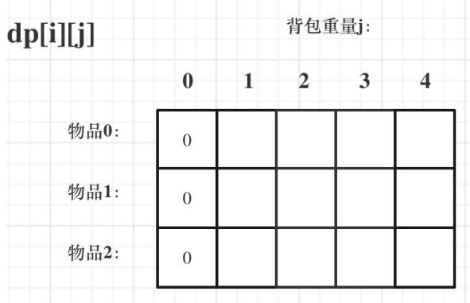
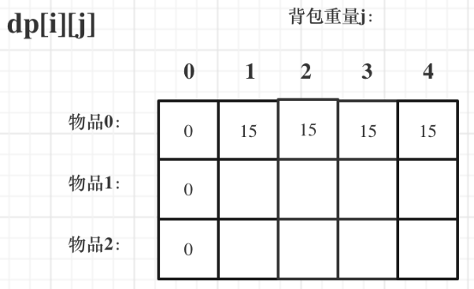
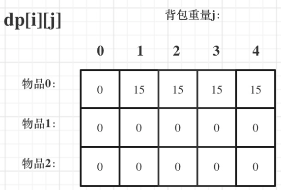
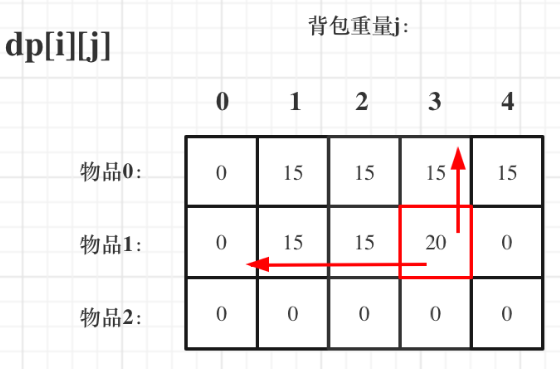
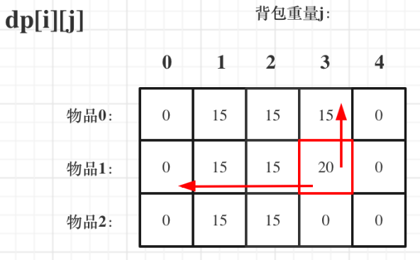
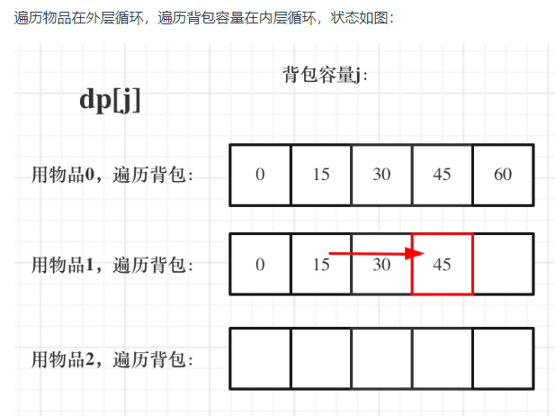
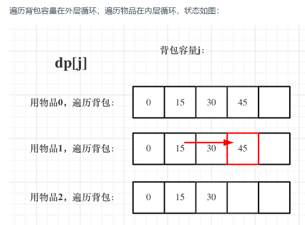
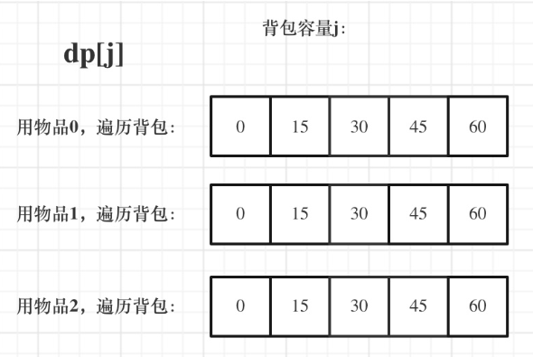

### 背包分类


### 01 背包

#### 题目

> ​	有n件物品和一个最多能背重量为w的背包。第i件物品的重量是weight[i]，得到的价值是value[i] 。**每件物品只能用一次**，求解将哪些物品装入背包里物品价值总和最大

#### 首先想到回溯

- 每一件物品只有两个状态，取或者不取，所以可以使用回溯法搜索出所有的情况，那么时间复杂度就是O(2^n)，这里的n表示物品数量

  ```javascript
  //类似如下代码
  function bag01(w, n, items, values) {
  	//存储背包中物品总价值的最大值
  	let maxV = 0
  	dfs(0, 0, 0)
  	return maxV
  	// cw表示当前已经装进去的物品的重量和
  	// cv表示当前已经装进去的物品的价值和
  	// i表示考察到哪个物品
  	function dfs(i, cw, cv) {
      // cw === w表示装满了;i === n表示已经考察完所有的物品
  		if (cw === w || i === n) {
  			if (cv > maxV) maxV = cv
  			return
  		}
  		dfs(i + 1, cw, cv) // 不装第 i + 1 个物品的情况
      // 已经超过可以背包承受的重量的时候，就不要再装了
  		if (cw + items[i] <= w) {
  			dfs(i + 1, cw + items[i], cv + values[i]) // 装第 i + 1 个物品的情况
  		}
  	}
  }
  ```

#### DP解法

##### dp定义

dp\[i\]\[j\]表示从下标为[0-i]的物品里任意取，放进容量为 j 的背包，最大价值是多少

##### 递推公式

dp\[i\]\[j\] = max(dp\[i - 1\]\[j\], dp\[i - 1\]\[j - weight\[i\]\] + value\[i\])

##### base case

- dp\[i\]\[0\]

  

- dp\[0\]\[j\] (当 j < weight[0]的时候，dp\[0\]\[j\] 是 0，因为背包容量比编号0的物品重量还小。

  当j >= weight[0]时，dp\[0\]\[j\] 应该是value\[0\]，因为背包容量放足够放编号0物品)

  

- 初始化代码

   ```javascript
    let dp = Array.from({length: items.length}, () => new Array(bagWeight + 1).fill(0))
    for (let j = weight[0]; j <= bagweight; j++) {
      dp[0][j] = value[0];
    }
   ```

- 最终初始化dp如图

   

##### 遍历顺序

- **先遍历物品，再遍历背包**

   ```javascript
   for (let i = 1; i < weight.length; i++) {
   	for (let j = 1; j <= bagWeight; j++) {
   		if (j < weight[i]) {
         dp[i][j] = dp[i - 1][j]
       } else {
         dp[i][j] = Math.max(dp[i - 1][j], dp[i - 1][j - weight[i]] + value[i])
       } 
   	}
   }
   ```

   

- 先遍历背包，再遍历物品

   ```javascript
   for (let j = 1; j <= bagWeight; j++) {
   	for (let i = 1; i < weight.length; i++) {
   		if (j < weight[i]) {
         dp[i][j] = dp[i - 1][j]
       } else {
         dp[i][j] = Math.max(dp[i - 1][j], dp[i - 1][j - weight[i]] + value[i])
       }
   	}
   }
   ```
   
   

- 最终dp结果


##### 完整代码

```javascript
const bag01 = (weight, value, bagWeight) => {
	const len = weight.length
	let dp = Array.from({ length: len }, () => new Array(bagWeight + 1).fill(0))
  //base case
	for (let j = weight[0]; j <= bagWeight; j++) dp[0][j] = value[0]
	// 先遍历物品，再遍历背包易于理解
  //第一行和第一列都已经初始化了
	for (let i = 1; i < len; i++) {
		for (let j = 1; j <= bagWeight; j++) {
			if (j < weight[i]) {
				dp[i][j] = dp[i - 1][j]
			} else {
				dp[i][j] = Math.max(dp[i - 1][j], dp[i - 1][j - weight[i]] + value[i])
			}
		}
	}
	return dp[len - 1][bagWeight]
}
console.log(bag01([1, 3, 4], [15, 20, 30], 4))
```

##### 状态压缩

###### dp定义

dp[j]表示：容量为j的背包，所背的最大物品价值为dp[j]

###### 递推公式

dp[j] = max(dp[j], dp[j - weight[i]] + value[i])

###### 初始化

dp[0] = 0,   其它根据递推公式初始化成0以防止被覆盖

###### ==遍历顺序==

1. 背包倒序遍历，保证物品i只被放入一次

2. 为什么二维dp数组历的时候不用倒序

   > 对于二维dp，dp\[i\]\[j\]都是通过上一层即dp\[i - 1\]\[j\]计算而来，只有前面的推导出来了才能正确推导出后面的dp数值，并且本层的dp\[i\]\[j\]并不会被覆盖！

3. 先遍历背包容量嵌套遍历物品

   > 滚动行没有更新完，即还未经过计算，直接覆盖了！
   >
   > 倒序遍历的原因是，本质上还是一个对二维数组的遍历，并且右下角的值依赖上一层左上角的值，因此需要保证左边的值仍然是上一层的，从右向左覆盖

###### 完整代码

```javascript
const bag01Advanced = (weight, value, bagWeight) => {
	const len = weight.length
  //滚动行 + basecase
	let dp = new Array(bagWeight + 1).fill(0)
	// 必须先遍历物品，再遍历背包
  // 背包必须倒序遍历，保证物品i只被放入一次，举例证明
	for (let i = 0; i < len; i++) {
    //结束条件为j >= 0则下面还需判断if (j - weight[i] >= 0) 才推导
		for (let j = bagWeight; j >= weight[i]; j--) {
			dp[j] = Math.max(dp[j], dp[j - weight[i]] + value[i])
		}
	}
	return dp[bagWeight]
}
console.log(bag01Advanced([1, 3, 4], [15, 20, 30], 4))
```

### 完全背包(每个物品无限次)

- **在完全背包中，对于一维dp数组来说，其实两个for循环嵌套顺序是无所谓的！**

  > dp[j] 是根据 下标j之前所对应的dp[j]计算出来的。 只要保证下标j之前的dp[j]都是经过计算的就可以了

- 先遍历物品

  ```javascript
  // 先遍历物品，再遍历背包
  for(let i = 0; i < weight.length; i++) {
    for(let j = weight[i]; j <= bagWeight ; j++) {
      dp[j] = Math.max(dp[j], dp[j - weight[i]] + value[i])
    }
  }
  ```

  

- 先遍历背包

  ```javascript
  // 先遍历背包，再遍历物品
  for(let j = 0; j <= bagWeight; j++) {
    for(let i = 0; i < weight.length; i++) {
      if (j - weight[i] >= 0) {
        dp[j] = Math.max(dp[j], dp[j - weight[i]] + value[i])
      }
    }
  }
  ```

  

  
  
- 最终dp图




##### 完整代码

```javascript
// 先遍历物品，再遍历背包
const bagComplete1 = (weight, value, bagWeight) => {
	let dp = new Array(bagWeight + 1).fill(0)
	for (let i = 0; i < weight.length; i++) {
		for (let j = weight[i]; j <= bagWeight; j++) {
			dp[j] = Math.max(dp[j], dp[j - weight[i]] + value[i])
		}
	}
	console.log(dp)
}

// 先遍历背包，再遍历物品
const bagComplete2 = (weight, value, bagWeight) => {
	let dp = new Array(bagWeight + 1).fill(0)
	for (let j = 0; j <= bagWeight; j++) {
		for (let i = 0; i < weight.length; i++) {
			if (j >= weight[i]) dp[j] = Math.max(dp[j], dp[j - weight[i]] + value[i])
		}
	}
	console.log(dp)
}
console.log(bagComplete([1, 3, 4], [15, 20, 30], 4))
```

##### 其他

- **如果求组合数就是外层for循环遍历物品，内层for遍历背包**
- **如果求排列数就是外层for遍历背包，内层for循环遍历物品**

### 总结

- 01背包二维物品、背包先后遍历顺序无所谓
- 01背包状态压缩版，必须先物品再背包（防止数据被覆盖，从右向左覆盖，本质是右下角的数据依赖上层左上角的数据），并且背包倒序遍历，防止物品被放置多次
- 完全背包状态压缩版，遍历顺序无所谓

