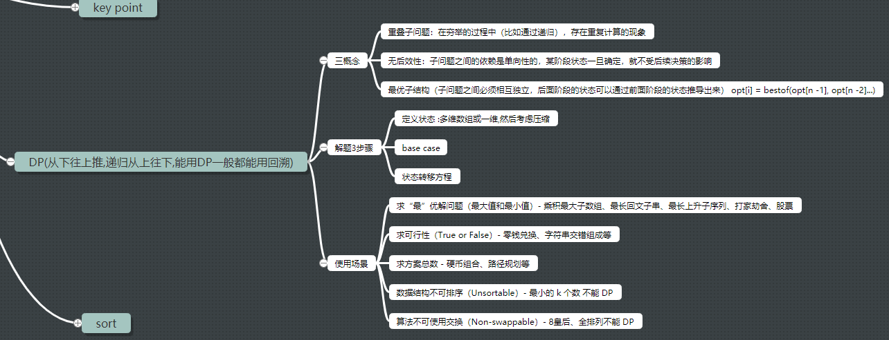
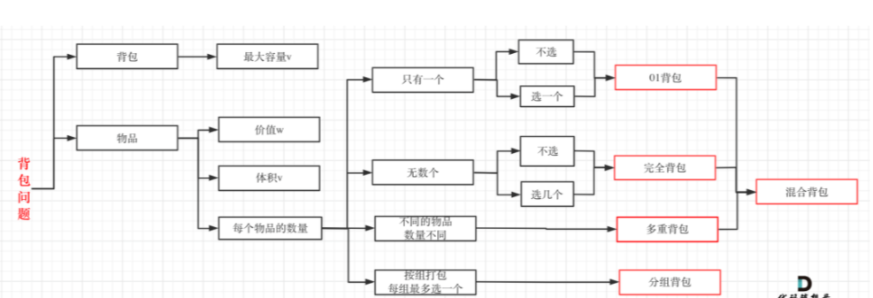
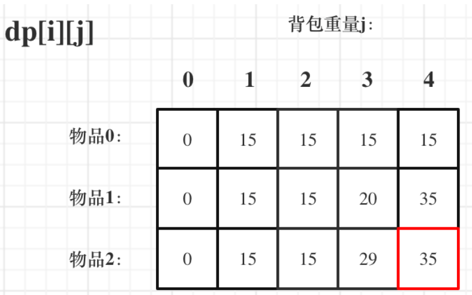

# 解题步骤

1. 确定dp数组（dp table）以及下标的含义
2. 确定递推公式(**一些情况是递推公式决定了dp数组要如何初始化,所以这条在前**)
3. dp数组如何初始化
4. 确定遍历顺序
5. 举例推导dp数组

# 线性 DP

### [5. ==最长回文子串==](https://leetcode-cn.com/problems/longest-palindromic-substring/)

```javascript {.line-numbers}
//brute force + reverse()
//O(N^3) - O(1)
var longestPalindrome = function (s) {
	if (!s) return ''
	const len = s.length
	if (len < 2) return s

	let maxLen = 1,
		begin = 0

	const isPalindrome = (s, l, r) => {
		while (l < r) {
			if (s[l] !== s[r]) return false
			l++
			r--
		}
		return true
	}

	for (let i = 0; i < len - 1; i++) {
		for (let j = i + 1; j < len; j++) {
			if (j - i + 1 > maxLen && isPalindrome(s, i, j)) {
				maxLen = j - i + 1
				begin = i
			}
		}
	}
	return s.substring(begin, begin + maxLen)
}

//DP  O(n^2) - O(n^2)
var longestPalindrome = function (s) {
	if (!s) return ''
	const len = s.length
	if (len < 2) return s

	//dp[i..j] 表示从i到j的子串是否是回文
	const dp = Array.from({ length: len }, () => new Array(len))

	let begin = 0,
		maxLen = 1

	//对角线等于true的case未用到,下列可以忽略不写
	for (let i = 0; i < len; i++) dp[i][i] = true
	//在状态转移方程中，是从长度较短的字符串向长度较长的字符串进行转移的，因此要注意动态规划的循环顺序
	//先升序填列，再升序填行
	//只需要填dp table上半边
	//先填左下角
	for (let j = 1; j < len; j++) {
		for (let i = 0; i < j; i++) {
			if (s[i] !== s[j]) {
				dp[i][j] = false
			} else {
				//j - i + 1 < 4，即当子串s[i..j]的长度等于2 or 3的时候，只需要判断一下头尾两个字符是否相等就可以直接下结论
				if (j - i < 3) {
					dp[i][j] = true
				} else {
					dp[i][j] = dp[i + 1][j - 1]
				}
			}

			if (dp[i][j] && j - i + 1 > maxLen) {
				maxLen = j - i + 1
				begin = i
			}
		}
	}
	return s.substring(begin, begin + maxLen)
}

//中心扩展法 O(n^2) - O(1)
var longestPalindrome = function (s) {
	if (!s) return ''
	const len = s.length
	if (len < 2) return s
	let maxLen = 1,
		begin = 0
	for (let i = 0; i < len; i++) {
		const oddLen = palindrome(s, i, i)
		const evenLen = palindrome(s, i, i + 1)
		const curMaxLen = Math.max(oddLen, evenLen)
		if (curMaxLen > maxLen) {
			maxLen = curMaxLen
			//囊括奇、偶两种情况向下取整
			begin = i - Math.floor((maxLen - 1) / 2)
		}
	}
	return s.substring(begin, begin + maxLen)

	function palindrome(s, l, r) {
		while (l >= 0 && r < s.length && s[l] === s[r]) {
			l--
			r++
		}
		return r - l - 1
	}
}
```

### [32.==最长有效括号==](https://leetcode-cn.com/problems/longest-valid-parentheses/)

```javascript {.line-numbers}
//brute force O(n^3)
var longestValidParentheses = function (s) {
	const len = s.length
	if (len < 2) return 0
	//有效括号肯定是偶数
	const end = len % 2 === 0 ? len : len - 1
	//从最长开始偶数递减loop
	for (let i = end; i >= 0; i -= 2) {
		for (let j = 0; j < len - i + 1; j++) {
			//找到即是最长的
			if (isValid(s.substring(j, j + i))) return i
		}
	}

	function isValid(s) {
		const stack = []
		for (let c of s) {
			if (c === '(') {
				stack.push('(')
			} else if (stack.length > 0 && stack[stack.length - 1] === '(') {
				stack.pop()
			} else {
				return false
			}
		}
		return stack.length === 0
	}
}

//DP O(n) - O(n)
var longestValidParentheses = function (s) {
	const len = s.length
	if (len < 2) return 0
	let ret = 0
	//dp[i] 表示以下标i字符结尾的最长有效括号的长度
	const dp = new Array(len).fill(0)
	for (let i = 1; i < len; i++) {
		if (s[i] == ')') {
			if (s[i - 1] == '(') {
				//s[i] = ')' 且 s[i - 1] = '(',也就是字符串形如 '……()'
				dp[i] = (i >= 2 ? dp[i - 2] : 0) + 2
			} else if (i - dp[i - 1] > 0 && s[i - dp[i - 1] - 1] == '(') {
				//s[i] = ')' 且 s[i - 1] = ')',也就是字符串形如 '……))'
				dp[i] = dp[i - 1] + (i - dp[i - 1] >= 2 ? dp[i - dp[i - 1] - 2] : 0) + 2
			}
			ret = Math.max(ret, dp[i])
		}
	}
	return ret
}

//stack O(n) - O(n)
//始终保持栈底元素为当前已经遍历过的元素中「最后一个没有被匹配的右括号的下标」
//对于遇到的每个(,将它下标放入栈中
//对于遇到的每个),先弹出栈顶元素表示匹配了当前右括号:
//  如果栈为空,说明当前的右括号为没有被匹配的左括号,将其下标放入栈中来更新「最后一个没有被匹配的右括号的下标」
//  如果栈不为空,当前右括号的下标减去栈顶元素即为「以该右括号为结尾的最长有效括号的长度」
var longestValidParentheses = function (s) {
	const len = s.length
	if (len < 2) return 0
	//最长子串只能从0开始
	const stack = [-1]
	let maxLen = 0
	for (let i = 0; i < len; i++) {
		if (s[i] === '(') {
			stack.push(i)
		} else {
			stack.pop()
			if (stack.length === 0) {
				stack.push(i)
			} else {
				maxLen = Math.max(maxLen, i - stack[stack.length - 1])
			}
		}
	}
	return maxLen
}

//正向逆向结合 O(n) - O(1)
var longestValidParentheses = function (s) {
	const len = s.length
	if (len < 2) return 0
	let left = 0,
		right = 0
	maxLen = 0
	for (let i = 0; i < len; i++) {
		s[i] === '(' ? left++ : right++
		if (left === right) {
			maxLen = Math.max(maxLen, left * 2)
		} else if (right > left) {
			left = right = 0
		}
	}
	left = right = 0
	for (let i = len - 1; i >= 0; i--) {
		s[i] === '(' ? left++ : right++
		if (left === right) {
			maxLen = Math.max(maxLen, left * 2)
		} else if (left > right) {
			left = right = 0
		}
	}
	return maxLen
}
```

### [44. 通配符匹配](https://leetcode-cn.com/problems/wildcard-matching/)

```javascript {.line-numbers}
var isMatch = function (s, p) {
	const m = s.length,
		n = p.length
	//dp[i][j] 表示字符串s的前i个字符和模式p的前j个字符是否能匹配
	const dp = Array.from({ length: m + 1 }, () => new Array(n + 1).fill(false))

	//base case
	//1 空串和空模式匹配
	//2 dp[i][0]=false,即空模式无法匹配非空字符串
	//3 dp[0][j] 需要分情况讨论:因为星号才能匹配空字符串,所以只有当模式p的前j个字符均为星号时,dp[0][j]才为真
	//case 1
	dp[0][0] = true
	//case 3
	for (let i = 1; i <= n; i++) {
		if (p[i - 1] === '*') {
			dp[0][i] = true
		} else {
			break
		}
	}

	for (let i = 1; i <= m; i++) {
		for (let j = 1; j <= n; j++) {
			//当前字符
			if (p[j - 1] === '*') {
				//不使用星 or 使用星
				dp[i][j] = dp[i][j - 1] || dp[i - 1][j]
			} else if (p[j - 1] === '?' || s[i - 1] === p[j - 1]) {
				dp[i][j] = dp[i - 1][j - 1]
			}
		}
	}
	return dp[m][n]
}
```

### [53. ==最大子序和==](https://leetcode-cn.com/problems/maximum-subarray/)

```javascript {.line-numbers}
//brute force
var maxSubArray = function (nums) {
	let max = -Infinity,
	const len = nums.length
	let sum = 0
	for (let i = 0; i < len; i++) {
		sum = 0
		for (let j = i; j < len; j++) {
			sum += nums[j]
			if (sum > max) max = sum
		}
	}
	return max
}

//前缀和优化
//S(i)表示以 0(包括 0)开始加到 i(包括 i)的前缀和,那么S(j) - S(i - 1)就等于从i开始(包括 i)加到j(包括 j)的前缀和
//只需要遍历一次计算出所有的 S(i), 其中 i = 0,1,2....,n-1.然后我们再减去之前的S(k),其中 k = 0，1，i - 1,中的最小值即可
//O(n) - O(1)
var maxSubArray = function(nums) {
  let preSum = 0, maxPreSum = nums[0], minPreSum = 0

  for (let num of nums) {
		//prefix sum
    preSum += num
    maxPreSum = Math.max(maxPreSum, preSum - minPreSum)
    minPreSum = Math.min(minPreSum, preSum)
  }
  return maxPreSum
}

//dp[i]表示nums中以nums[i]结尾的最大子序和
//dp[i] = max(dp[i - 1] + nums[i], nums[i])
//base case dp[0] = nums[0]
//O(n) - O(1)
var maxSubArray = function (nums) {
	let preSum = 0,
		maxPreSum = nums[0]
	nums.forEach((num) => {
		//若前面sum小于0,舍弃
		preSum = Math.max(preSum + num, num)
		maxPreSum = Math.max(maxPreSum, preSum)
	})
	return maxPreSum
}
```

### [64. ==最小路径和==](https://leetcode-cn.com/problems/minimum-path-sum/)

```javascript {.line-numbers}
//dp[i][j]表示从(i,j)走到(m-1, n-1)点的最小路径和
var minPathSum = function (grid) {
	if (!grid) return 0
	const rows = grid.length,
		cols = grid[0].length
	if (rows === 0 || cols === 0) return 0

	const dp = Array.from({ length: rows }, () => new Array(cols).fill(Infinity))

	//base case
	dp[0][0] = grid[0][0]

	//第一列
	for (let i = 1; i < rows; i++) {
		dp[i][0] = dp[i - 1][0] + grid[i][0]
	}

	//第一行
	for (let j = 1; j < cols; j++) {
		dp[0][j] = dp[0][j - 1] + grid[0][j]
	}

	for (let i = 1; i < rows; i++) {
		for (let j = 1; j < cols; j++) {
			dp[i][j] = Math.min(dp[i - 1][j], dp[i][j - 1]) + grid[i][j]
		}
	}
	return dp[rows - 1][cols - 1]
}

//优化空间
var minPathSum = function (grid) {
	if (!grid) return 0
	const rows = grid.length,
		cols = grid[0].length

	if (!rows || !cols) return 0

	//滚动列
	const dp = new Array(cols).fill(Infinity)

	dp[0] = grid[0][0]

	for (let i = 0; i < rows; i++) {
		for (let j = 0; j < cols; j++) {
			if (i === 0 && j === 0) continue
			else if (i === 0) {
				dp[j] = dp[j - 1] + grid[i][j]
			} else if (j === 0) {
				dp[j] += grid[i][j]
			} else {
				dp[j] = Math.min(dp[j], dp[j - 1]) + grid[i][j]
			}
		}
	}
	return dp[cols - 1]
}
```

### [72. 编辑距离](https://leetcode-cn.com/problems/edit-distance/)

```javascript {.line-numbers}
//O(mn) - O(mn)
var minDistance = function (word1, word2) {
	const m = word1.length,
		n = word2.length

	//D[i][j] 表示A的前i个字母和B的前j个字母之间的编辑距离
	const dp = Array.from({ length: m + 1 }, () => new Array(n + 1))

	//一个空串和一个非空串的编辑距离为 D[i][0] = i 和 D[0][j] = j,D[i][0] 相当于对 word1 执行 i 次删除操作
	for (let i = 0; i <= m; i++) {
		dp[i][0] = i
	}

	//D[0][j] 相当于对 word1执行 j 次插入操作
	for (let j = 0; j <= n; j++) {
		dp[0][j] = j
	}

	for (let i = 1; i <= m; i++) {
		for (let j = 1; j <= n; j++) {
			if (word1[i - 1] === word2[j - 1]) {
				dp[i][j] = dp[i - 1][j - 1]
			} else {
				dp[i][j] = Math.min(dp[i][j - 1], dp[i - 1][j], dp[i - 1][j - 1]) + 1
			}
		}
	}
	return dp[m][n]
}

//O(mn) - O(n)
var minDistance = function (word1, word2) {
	const m = word1.length,
		n = word2.length

	const dp = new Array(n + 1)

	//第一列
	for (let j = 0; j <= n; j++) {
		dp[j] = j
	}

	for (let i = 1; i <= m; i++) {
		//save下面需要替换
		let temp = dp[0]
		//dp数组的每一列的第一个j-1，也就是第一行的这个格子
		dp[0] = i
		for (let j = 1; j <= n; j++) {
			//dp[i - 1][j - 1]
			const pre = temp
			//update dp[i - 1][j - 1]
			temp = dp[j]
			if (word1[i - 1] === word2[j - 1]) {
				dp[j] = pre
			} else {
				// dp[j] = min(dp[j-1], pre, dp[j]) + 1
				dp[j] = Math.min(dp[j - 1], dp[j], pre) + 1
			}
		}
	}
	return dp[n]
}
```

### [91. ==解码方法==](https://leetcode-cn.com/problems/decode-ways/)

```javascript {.line-numbers}
var numDecodings = function (s) {
	if (!s) return 0
	const len = s.length
	const dp = Array(len + 1).fill(0)
	dp[0] = 1
	dp[1] = s[0] === '0' ? 0 : 1
	for (let i = 2; i <= len; i++) {
		if (s[i - 1] !== '0') {
			dp[i] += dp[i - 1]
		}
		if (
			s[i - 2] === '1' ||
			(s[i - 2] === '2' && s[i - 1] >= 0 && s[i - 1] <= 6)
		) {
			dp[i] += dp[i - 2]
		}
	}
	return dp[len]
}
```

### [118. ==杨辉三角==](https://leetcode-cn.com/problems/pascals-triangle/)

```javascript {.line-numbers}
var generate = function (numRows) {
	const triangle = []
	for (let i = 0; i < numRows; i++) {
		const curRow = []
		curRow[0] = 1
		curRow[i] = 1
		if (i > 1) {
			for (let j = 1; j < i; j++) {
				curRow[j] = triangle[i - 1][j - 1] + triangle[i - 1][j]
			}
		}
		triangle.push(curRow)
	}
	return triangle
}
```

### [120. ==三角形最小路径和==](https://leetcode-cn.com/problems/triangle/)

```javascript {.line-numbers}
//DFS O(2^^n)
const minimumTotal = (triangle) => {
	return dfs(0, 0, triangle) + triangle[0][0]
	function dfs(i, i) {
		if (i >= triangle.length - 1) return 0
		// 往左下节点走
		const leftSum = traverse(i + 1, j) + triangle[i + 1][j]
		// 往右下节点走
		const rightSum = traverse(i + 1, j + 1) + triangle[i + 1][j + 1]
		// 记录每个节点往左和往右遍历的路径和的最小值
		return Math.min(leftSum, rightSum)
	}
}

//O(n^2) - O(n^2)
//自底向上不需要最后再遍历最后一层数组找最小值
const minimumTotal = (triangle) => {
	if (!triangle) return 0
	let height = triangle.length
	if (height === 0) return 0

	const dp = Array.from(
		{ length: height },
		(val, index) => new Array(triangle[index].length)
	)

	// 自底而上遍历
	for (let i = height - 1; i >= 0; i--) {
		for (let j = 0; j < triangle[i].length; j++) {
			// base case 最底层
			if (i == height - 1) {
				dp[i][j] = triangle[i][j]
			} else {
				// 状态转移方程，上一层由它下一层计算出
				dp[i][j] = Math.min(dp[i + 1][j], dp[i + 1][j + 1]) + triangle[i][j]
			}
		}
	}
	return dp[0][0]
}

//O(n^2) - O(2n)
//滚动数组优化

//O(n^2) - O(n)
var minimumTotal = function (triangle) {
	if (!triangle) return 0
	let height = triangle.length
	if (height === 0) return 0

	const dp = new Array(height)
	// base case 是最后一行
	for (let i = 0; i < height; i++) {
		dp[i] = triangle[height - 1][i]
	}

	for (let i = height - 2; i >= 0; i--) {
		for (let j = 0; j <= i; j++) {
			dp[j] = Math.min(dp[j], dp[j + 1]) + triangle[i][j]
		}
	}
	return dp[0]
}
```

### [152. ==乘积最大子数组==](https://leetcode-cn.com/problems/maximum-product-subarray/)

```javascript {.line-numbers}
//O(n) - O(n)
var maxProduct = function (nums) {
	let len = nums.length
	if (len === 0) return 0

	const maxDP = [...nums],
		minDP = [...nums]

	for (let i = 1; i < len; i++) {
		maxDP[i] = Math.max(maxDP[i - 1] * nums[i], nums[i], minDP[i - 1] * nums[i])
		minDP[i] = Math.min(minDP[i - 1] * nums[i], nums[i], maxDP[i - 1] * nums[i])
	}
	let ret = maxDP[0]
	for (let i = 1; i < len; i++) {
		ret = Math.max(ret, maxDP[i])
	}
	return ret
}

//O(n) - O(1)
var maxProduct = function (nums) {
	let len = nums.length
	if (len === 0) return 0

	let preMax = nums[0],
		preMin = nums[0],
		curMax,
		curMin,
		ret = nums[0]

	for (let i = 1; i < len; i++) {
		curMax = Math.max(nums[i], preMax * nums[i], preMin * nums[i])
		curMin = Math.min(nums[i], preMin * nums[i], preMax * nums[i])
		ret = Math.max(ret, curMax)
		preMax = curMax
		preMin = curMin
	}

	return ret
}
```

### [221. ==最大正方形==](https://leetcode-cn.com/problems/maximal-square/)

```javascript {.line-numbers}
var maximalSquare = (matrix) => {
	let maxSide = 0
	if (matrix == null || matrix.length === 0 || matrix[0].length === 0)
		return maxSide
	const rows = matrix.length,
		columns = matrix[0].length
	const dp = Array.from({ length: rows }, () => new Array(columns).fill(0))
	for (let i = 0; i < rows; i++) {
		for (let j = 0; j < columns; j++) {
			if (matrix[i][j] == '1') {
				if (i === 0 || j === 0) {
					dp[i][j] = 1
				} else {
					dp[i][j] =
						Math.min(Math.min(dp[i - 1][j], dp[i][j - 1]), dp[i - 1][j - 1]) + 1
				}
				maxSide = Math.max(maxSide, dp[i][j])
			}
		}
	}
	return maxSide * maxSide
}
```

### [279. ==完全平方数==](https://leetcode-cn.com/problems/perfect-squares/)

```javascript {.line-numbers}
var numSquares = function (n) {
	const dp = [...Array(n + 1)].map((_) => 0) // 数组长度为n+1，值均为0
	for (let i = 1; i <= n; i++) {
		dp[i] = i // 最坏的情况就是每次+1
		for (let j = 1; i - j * j >= 0; j++) {
			dp[i] = Math.min(dp[i], dp[i - j * j] + 1)
		}
	}
	return dp[n]
}
```

### [300. ==最长递增子序列==](https://leetcode-cn.com/problems/longest-increasing-subsequence/)

```javascript {.line-numbers}
//O(n^2) - O(n)
var lengthOfLIS = function (nums) {
	const len = nums.length
	if (len === 0) return 0
	//定义dp[i]为考虑前i个元素,以第i个数字结尾的最长上升子序列的长度,注意nums[i]必须被选取
	const dp = new Array(len).fill(1)
	let ret = 1
	//dp[i]=max(dp[0…i−1])+1,其中0≤j<i且num[j]<num[i]
	for (let i = 0; i < len; i++) {
		for (let j = 0; j < i; j++) {
			if (nums[i] > nums[j]) {
				dp[i] = Math.max(dp[i], dp[j] + 1)
			}
		}
		ret = Math.max(ret, dp[i])
	}
	return ret
}

var lengthOfLIS = function (nums) {
	const len = nums.length
	if (len === 0) return 0
	const dp = new Array(len).fill(0)
	dp[0] = 1
	let ret = 1
	for (let i = 1; i < len; i++) {
		dp[i] = 1 //只a[i]一个数
		for (let j = 0; j < i; j++) {
			if (nums[i] > nums[j]) {
				dp[i] = Math.max(dp[i], dp[j] + 1)
			}
		}
		//每次check
		ret = Math.max(ret, dp[i])
	}
	return ret
}
```

### [343. ==整数拆分==](https://leetcode-cn.com/problems/integer-break/)

```javascript {.line-numbers}
var integerBreak = function (n) {
	const dp = new Array(n + 1).fill(0)
	//dp[i]：分拆数字i，可以得到的最大乘积为dp[i]
	//dp[0]、dp[1]没意义
	dp[2] = 1

	for (let i = 3; i <= n; i++) {
		//遍历所有可拆分的j
		for (let j = 1; j < i; j++) {
			dp[i] = Math.max(dp[i], Math.max(j * (i - j), j * dp[i - j]))
		}
	}
	return dp[n]
}
```

### [718. ==最长重复子数组==](https://leetcode-cn.com/problems/maximum-length-of-repeated-subarray/)

```javascript {.line-numbers}
/**
 * @param {number[]} A
 * @param {number[]} B
 * @return {number}
 */
var findLength = function (A, B) {
	let m = A.length,
		n = B.length,
		ret = 0,
		//init two-dimension array
		dp = new Array(m + 1)
	for (let i = 0; i < m + 1; i++) {
		dp[i] = new Array(n + 1).fill(0)
	}

	for (let i = 1; i <= m; i++) {
		for (let j = 1; j <= n; j++) {
			if (A[i - 1] === B[j - 1]) {
				dp[i][j] = dp[i - 1][j - 1] + 1
			}
			ret = Math.max(ret, dp[i][j])
		}
	}
	return ret
}
```

### [746. 使用最小花费爬楼梯](https://leetcode-cn.com/problems/min-cost-climbing-stairs/)

```javascript {.line-numbers}
var minCostClimbingStairs = function (cost) {
	const len = cost.length
	const dp = new Array(len + 1)
	//由于可以选择下标0或1作为初始阶梯,因此有dp[0]=dp[1]=0
	dp[0] = dp[1] = 0
	for (let i = 2; i <= len; i++) {
		dp[i] = Math.min(dp[i - 1] + cost[i - 1], dp[i - 2] + cost[i - 2])
	}
	return dp[len]
}

//dp[i] 表示达到下标i的最小花费
//dp[i]=min(dp[i−1]+cost[i−1],dp[i−2]+cost[i−2])
var minCostClimbingStairs = function (cost) {
	const len = cost.length
	let prev = (cur = 0),
		next
	for (let i = 2; i <= len; i++) {
		next = Math.min(cur + cost[i - 1], prev + cost[i - 2])
		prev = cur
		cur = next
	}
	return cur
}
```

### [1143. ==最长公共子序列==](https://leetcode-cn.com/problems/longest-common-subsequence/)

```javascript {.line-numbers}
var longestCommonSubsequence = function (text1, text2) {
	const n = text1.length
	const m = text2.length
	//直接第一行和第一列赋值base case为0,第一行第一列代表的是空,下面也不需要判断越界
	const dp = Array.from(new Array(n + 1), () => new Array(m + 1).fill(0))

	for (let i = 1; i <= n; i++) {
		for (let j = 1; j <= m; j++) {
			//dp[i][j] = Math.max(dp[i][j - 1], dp[i - 1][j])
			//if (text1[i - 1] === text2[j - 1])dp[i][j] = dp[i - 1][j - 1] + 1
			if (text1[i - 1] === text2[j - 1]) {
				dp[i][j] = dp[i - 1][j - 1] + 1
			} else {
				dp[i][j] = Math.max(dp[i][j - 1], dp[i - 1][j])
			}
		}
	}
	return dp[n][m]
}
```

## 打家劫舍系列

### [198. 打家劫舍](https://leetcode-cn.com/problems/house-robber/)

```javascript {.line-numbers}
//O(n) - O(n)
var rob = function (nums) {
	const len = nums.length
	if (len === 0) return 0
	if (len === 1) return nums[0]
	//dp[i] 表示前i - 1间房屋能偷窃到的最高总金额
	const dp = new Array(len)
	;(dp[0] = nums[0]), (dp[1] = Math.max(nums[0], nums[1]))
	for (let i = 2; i < len; i++) {
		dp[i] = Math.max(dp[i - 1], dp[i - 2] + nums[i])
	}
	return dp[len - 1]
}

//O(n) - O(1)
var rob = function (nums) {
	const len = nums.length
	if (len === 0) return 0
	if (len === 1) return nums[0]
	let first = nums[0],
		second = Math.max(nums[0], nums[1]),
		temp
	for (let i = 2; i < len; i++) {
		temp = second
		second = Math.max(second, first + nums[i])
		first = temp
	}
	return second
}
```

### [213. 打家劫舍 II](https://leetcode-cn.com/problems/house-robber-ii/)

```javascript {.line-numbers}
//O(n) - O(1)
var rob = function (nums) {
	const len = nums.length
	if (len === 0) return 0
	if (len === 1) return nums[0]
	//该问题可以看成两个单排问题
	return Math.max(robRange(nums, 0, len - 2), robRange(nums, 1, len - 1))

	function robRange(nums, start, end) {
		let dp_i_1 = 0,
			dp_i_2 = 0,
			dp_i = 0
		for (let i = start; i <= end; i++) {
			dp_i = Math.max(dp_i_1, nums[i] + dp_i_2)
			dp_i_2 = dp_i_1
			dp_i_1 = dp_i
		}
		return dp_i
	}
}
```

### [337. 打家劫舍 III 树形 DP](https://leetcode-cn.com/problems/house-robber-iii/)

```javascript {.line-numbers}
//time exceeded!!!
var rob = function (root) {
	const helper = (root) => {
		if (root == null) return 0
		if (memo.has(root)) return memo.get(root)
		// 抢，然后去下下家
		const do_it =
			root.val +
			(root.left == null ? 0 : rob(root.left.left) + rob(root.left.right)) +
			(root.right == null ? 0 : rob(root.right.left) + rob(root.right.right))
		// 不抢，然后去下家
		const not_do = rob(root.left) + rob(root.right)
		const ret = Math.max(do_it, not_do)
		memo.set(root, ret)
		return ret
	}
	const memo = new Map()
	return helper(root)
}

var rob = function (root) {
	const helper = (root) => {
		if (root === null) return [0, 0]
		// 0: rob 1: notRob
		const l = helper(root.left)
		const r = helper(root.right)

		const robed = root.val + l[1] + r[1]
		const notRobed = Math.max(l[0], l[1]) + Math.max(r[0], r[1])
		//返回当前节点偷还是不偷
		return [robed, notRobed]
	}
	const [robed, notRobed] = helper(root)
	return Math.max(robed, notRobed)
}
```

## 股票系列

### [121. ==买股票的最佳时机 E==](https://leetcode-cn.com/problems/best-time-to-buy-and-sell-stock/)

```javascript {.line-numbers}
//只能交易一次
//brute force O(n^2) - O(1) Time exceeded
var maxProfit = function (prices) {
	const len = prices.length
	if (len < 2) return 0
	let maxProfit = 0,
		profit

	//loop every two different days
	for (let i = 0; i < len - 1; i++) {
		for (let j = i + 1; j < len; j++) {
			profit = prices[j] - prices[i]
			if (profit > maxProfit) maxProfit = profit
		}
	}
	return maxProfit
}

//Greedy - loop once
var maxProfit = function (prices) {
	const len = prices.length
	if (len < 2) return 0
	let maxProfit = 0,
		//维护一个最小值
		minPrice = Infinity
	for (let i = 0; i < len; i++) {
		minPrice = Math.min(minPrice, prices[i])
		maxProfit = Math.max(maxProfit, prices[i] - minPrice)
	}
	return maxProfit
}
```

### [122. ==买卖股票的最佳时机 2E==](https://leetcode-cn.com/problems/best-time-to-buy-and-sell-stock-ii/)

```javascript {.line-numbers}
//Greedy 每天可以交易一次
var maxProfit = function (prices) {
	let ret = 0
	let len = prices.length
	if (len < 2) return 0
	for (let i = 1; i < len; i++) {
		//profit += Math.max(prices[i] - prices[i - 1], 0);
		// if (prices[i] > prices[i - 1]) {
		// 	profit += prices[i] - prices[i - 1]
		// }
		ret += Math.max(prices[i] - prices[i - 1], 0)
	}
	return ret
}

//DFS  Time Limit Exceeded
var maxProfit = function (prices) {
	const dfs = (prices, level) => {
		if (level >= prices.length) return 0
		let ret = 0

		//计算每天可能的利润
		for (let start = level; start < prices.length; start++) {
			let maxProfit = 0
			for (let i = start + 1; i < prices.length; i++) {
				if (prices[i] > prices[start]) {
					let profit = dfs(prices, i + 1) + prices[i] - prices[start]
					if (profit > maxProfit) maxProfit = profit
				}
			}
			//每一次的最大利润
			if (maxProfit > ret) ret = maxProfit
		}
		return ret
	}
	return dfs(prices, 0)
}

//DP O(n)-O(n)
var maxProfit = function (prices) {
	let len = prices.length
	if (len < 2) return 0

	//状态 dp[i][j]
	//第一维i表示索引为i的那一天(具有前缀性质,即考虑了之前天数的收益)能获得的最大利润
	//第二维j表示索引为i的那一天是持有股票,还是持有现金。这里0表示持有现金(cash),1表示持有股票(stock)

	const dp = Array.from({ length: len }, (v, i) => new Array(2))

	dp[0][0] = 0
	dp[0][1] = -prices[0]

	for (let i = 1; i < len; i++) {
		dp[i][0] = Math.max(dp[i - 1][0], dp[i - 1][1] + prices[i])
		dp[i][1] = Math.max(dp[i - 1][1], dp[i - 1][0] - prices[i])
	}
	return dp[len - 1][0]
}

//DP O(n)-O(n)
var maxProfit = function (prices) {
	let len = prices.length
	if (len < 2) return 0

	//分开定义
	let cash = new Array(len)
	let hold = new Array(len)

	cash[0] = 0
	hold[0] = -prices[0]
	for (let i = 1; i < len; i++) {
		cash[i] = Math.max(cash[i - 1], hold[i - 1] + prices[i])
		hold[i] = Math.max(hold[i - 1], cash[i - 1] - prices[i])
	}

	return cash[len - 1]
}

//DP O(n)-O(1)
var maxProfit = function (prices) {
	let len = prices.length
	if (len < 2) return 0

	//分开定义
	let cash = 0
	let hold = -prices[0]

	let preCash = cash,
		preHold = hold
	for (let i = 1; i < len; i++) {
		cash = Math.max(preCash, preHold + prices[i])
		hold = Math.max(preHold, preCash - prices[i])

		preCash = cash
		preHold = hold
	}
	return cash
}
```

# 区间 DP

### [516. ==最长回文子序列==](https://leetcode-cn.com/problems/longest-palindromic-subsequence/)

```javascript {.line-numbers}
var longestPalindromeSubseq = function (s) {
	const len = s.length
	//dp[i][j] 表示s前i个字符到前j个字符的最长回文子序列
	//只填写了上半部，未优化
	const dp = Array.from({ length: len }, () => new Array(len).fill(0))

	//i 从最后一个字符开始往前遍历，j 从 i + 1 开始往后遍历，这样可以保证每个子问题都已经算好
	for (let i = len - 1; i >= 0; i--) {
		dp[i][i] = 1
		for (let j = i + 1; j < len; j++) {
			if (s[i] === s[j]) {
				dp[i][j] = dp[i + 1][j - 1] + 2
			} else {
				dp[i][j] = Math.max(dp[i + 1][j], dp[i][j - 1])
			}
		}
	}
	return dp[0][len - 1]
}
```

# 背包 DP

### 01 背包



**背包问题的理论基础重中之重是 01 背包，一定要理解透！**

1. **dp\[i\]\[j\]表示从下标为[0-i]的物品里任意取，放进容量为 j 的背包，价值总和最大是多少**

2. **dp\[i\]\[j\] = max(dp\[i - 1\]\[j\], dp\[i - 1\]\[j - weight\[i\]\] + value\[i\])**
3. base case, 注意倒序遍历和是否价值有正负



4. 优化：注意遍历方向

```javascript
//二维解法
function testWeightBagProblem(weight, value, bagWeight) {
	const len = weight.length,
		dp = Array(len) //empty
			.fill() //undefined
			.map(() => Array(bagWeight + 1).fill(0)) //注意数组偏移和第一列已经初始化为0
	for (let j = weight[0]; j <= bagWeight; j++) dp[0][j] = value[0]
	//先遍历物品(本题本解法两个状态遍历顺序随意,都不影响dp公式的推导)
	for (let i = 1; i < len; i++) {
		//再遍历背包容量
		for (let j = 0; j <= bagWeight; j++) {
			//不放
			if (j < weight[i]) {
				dp[i][j] = dp[i - 1][j]
				//放
			} else {
				dp[i][j] = Math.max(dp[i - 1][j], dp[i - 1][j - weight[i]] + value[i])
			}
		}
	}
	console.table(dp)
	return dp[len - 1][bagWeight]
}

//一维解法
function testWeightBagProblem2(weight, value, bagWeight) {
	const len = weight.length,
		//dp[j]表示：容量为j的背包，所背的物品最大价值
		//第一行初始化为0
		dp = Array(bagWeight + 1).fill(0)
	for (let i = 1; i <= len; i++) {
		//倒序遍历是为了保证物品i只被放入一次!!!
		//从右向左覆盖,一维解法不能修改两个状态的遍历先后和遍历方向!!!
		for (let j = bagWeight; j >= weight[i - 1]; j--) {
			dp[j] = Math.max(dp[j], value[i - 1] + dp[j - weight[i - 1]])
		}
	}
	console.log(dp)
	return dp[bagWeight]
}
```

### 完全背包

```javascript
// 先遍历物品，再遍历背包容量
function testCompletePack1() {
	const weight = [1, 3, 5]
	const value = [15, 20, 30]
	const bagWeight = 4
	let dp = new Array(bagWeight + 1).fill(0)
	for (let i = 0; i < weight.length; i++) {
		for (let j = weight[i]; j <= bagWeight; j++) {
			dp[j] = Math.max(dp[j], dp[j - weight[i]] + value[i])
		}
	}
	console.log(dp)
}

// 先遍历背包容量，再遍历物品
function testCompletePack2() {
	const weight = [1, 3, 5]
	const value = [15, 20, 30]
	const bagWeight = 4
	let dp = new Array(bagWeight + 1).fill(0)
	for (let j = 0; j <= bagWeight; j++) {
		for (let i = 0; i < weight.length; i++) {
			if (j >= weight[i]) dp[j] = Math.max(dp[j], dp[j - weight[i]] + value[i])
		}
	}
	console.log(dp)
}
```

### [322. ==零钱兑换==](https://leetcode-cn.com/problems/coin-change/)

```javascript {.line-numbers}
//Greedy
var coinChange = function (coins, amount) {
	if (coins.length === 0) return -1
	if (amount < 1) return 0
	let ret = Infinity
	const greedyDFS = (coins, remain, coinsIdx, count) => {
		if (remain === 0) {
			ret = Math.min(ret, count)
			return
		}
		if (coinsIdx > coins.length) return

		//直接拿最大币值的最大个数找解
		//coins递减
		//i + count < ret剪枝非最小count解，不加则time exceeded
		for (
			let i = Math.floor(remain / coins[coinsIdx]);
			i >= 0 && i + count < ret;
			i--
		) {
			greedyDFS(coins, remain - i * coins[coinsIdx], coinsIdx + 1, i + count)
		}
	}
	//desc + precondition for greedy
	coins.sort((a, b) => b - a)
	greedyDFS(coins, amount, 0, 0)
	return ret === Infinity ? -1 : ret
}

//dfs time exceeded
//O(S^n) - O(n)  S总金额
var coinChange = function (coins, amount) {
	if (coins.length === 0) return -1
	if (amount < 1) return 0

	const dfs = (coins, remain, count) => {
		if (remain < 0) return
		if (remain === 0) {
			ret = Math.min(ret, count)
			return
		}
		for (let i = 0, len = coins.length; i < len; i++) {
      //不需要回溯
			dfs(coins, remain - coins[i], count + 1)
		}
	}
	let ret = Infinity
	dfs(coins, amount, 0)
	return ret === Infinity ? -1 : ret
}

//dfs + Memoization
//O(Sn) + O(S)
var coinChange = function (coins, amount) {
	if (coins.length === 0) -1
	if (amount < 1) return 0
	const cache = {}
	const dfs = (coins, remain) => {
		if (remain < 0) return -1
		if (remain === 0) return 0
		if (cache[remain]) return cache[remain]
		//当前层需要取下面所有的情况的最小值
    //F(X) = min(F(0)....F(X - 1))
		let min = Infinity
		for (let i = 0, len = coins.length; i < len; i++) {
			const ret = dfs(coins, remain - coins[i])
			//加1是为了加上得到ret结果的那个步骤中兑换的那一个硬币
			//下层返回需要有意义并且是下层需要最少的硬币个数
			if (ret >= 0 && ret < min) min = ret + 1
		}
		return (cache[remain] = min === Infinity ? -1 : min)
	}
	return dfs(coins, amount)
}

//dp1 自底向上
const coinChange = (coins, amount) => {
	if (coins.length === 0) return -1
	if (amount < 1) return 0
	//dp[i]:组成金额i所需最少的硬币数量,初始化成不可能的数,防止后面被覆盖
	const dp = Array(amount + 1).fill(Infinity)
	//当i = 0时无法用硬币组成
	dp[0] = 0
	for (let i = 0; i < coins.length; i++) {
		for (let j = coins[i]; j <= amount; j++) {
			dp[j] = Math.min(dp[j - coins[i]] + 1, dp[j])
		}
	}
	return dp[amount] === Infinity ? -1 : dp[amount]
}

//dp2
//O(Sn) + O(S)
var coinChange = function (coins, amount) {
	if (coins.length === 0) return -1
	if (amount < 1) return 0
	//dp[i]:组成金额i所需最少的硬币数量,初始化成不可能的数,防止后面被覆盖
	dp = new Array(amount + 1).fill(Infinity)
	//当i = 0时无法用硬币组成
	dp[0] = 0
	for (let i = 1; i <= amount; i++) {
		//dp[i] = min(F(1−1),F(1−2),F(1−5)) + 1
		for (let j = 0, len = coins.length; j < len; j++) {
			//数组越界,语义上是当前剩余面值需要大于硬币价值才有意义
			if (i - coins[j] >= 0) dp[i] = Math.min(dp[i], dp[i - coins[j]] + 1)
		}
	}
	return dp[amount] === Infinity ? -1 : dp[amount]
}
```

### [518. ==零钱兑换 II==](https://leetcode-cn.com/problems/coin-change-2/)

```javascript {.line-numbers}
var change = function (amount, coins) {
  //dp[j]：凑成总金额j的货币组合数为dp[j]
	const dp = new Array(amount + 1).fill(0)
  //语义上讲凑成总金额0的货币组合数为1
	dp[0] = 1
  //如下遍历顺序dp[j]里计算的是组合数！
  //若调整状态遍历顺序则计算的是排列数！
	for (const coin of coins) {
    //dp[j] += dp[j - nums[j]]
		for (let j = coin; j <= amount; j++) dp[j] += dp[j - coin]
	}
	return dp[amount]
}
```

# 树形 DP

### 见打家劫舍 III

# 状态压缩 DP

# 数位 DP

# 计数型 DP

### [62. ==不同路径==](https://leetcode-cn.com/problems/unique-paths/)

```javascript {.line-numbers}
//DFS O(2^(m + n - 1) - 1)
var uniquePaths = function (m, n) {
	return dfs(1, 1, m, n)
	function dfs(i, j, m, n) {
		// 越界了
		if (i > m || j > n) return 0
		// 找到一种方法,相当于找到了叶子节点
		if (i === m && j === n) return 1
		return dfs(i + 1, j, m, n) + dfs(i, j + 1, m, n)
	}
}

//O(mn) - O(mn)
var uniquePaths = function (m, n) {
	const dp = Array.from({ length: m }, () => new Array(n).fill(0))
	//base case第一列
	for (let i = 0; i < m; i++) dp[m][0] = 1
	//base case第一行
	for (let i = 0; i < n; i++) dp[0][n] = 1
	//不影响最终结果
	//dp[0][0] = 0
	for (let i = 1; i < m; i++) {
		for (let j = 1; j < n; i++) {
			dpp[i][j] = dp[i - 1][j] + dp[i][j - 1]
		}
	}
	return dp[m - 1][n - 1]
}

//O(mn) - O(n)
var uniquePaths = function (m, n) {
	//一行一行向下滚动
  //初始化第一行，也符合base数据，隐含初始化了第一列
	const dp = new Array(n).fill(1)
	for (let i = 1; i < m; i++) {
		for (let j = 1; j < n; j++) dp[j] += dp[j - 1]
	}
	return dp[j - 1]
}
```

### [63. 不同路径 II](https://leetcode-cn.com/problems/unique-paths-ii/)

```javascript {.line-numbers}
var uniquePathsWithObstacles = function (obstacleGrid) {
	const m = obstacleGrid.length,
		n = obstacleGrid[0].length,
		dp = Array.from({ length: m }, () => new Array(n).fill(0))

	//base case
	for (let i = 0; i < m && obstacleGrid[i][0] === 0; i++) dp[i][0] = 1
	for (let i = 0; i < n && obstacleGrid[0][i] === 0; i++) dp[0][i] = 1

	for (let i = 1; i < m; i++) {
		for (let j = 1; j < n; j++) {
			if (obstacleGrid[i][j] === 1) continue
			dp[i][j] = dp[i - 1][j] + dp[i][j - 1]
		}
	}
	return dp[m - 1][n - 1]
}

//优化空间
var uniquePathsWithObstacles = function (obstacleGrid) {
	const m = obstacleGrid.length,
		n = obstacleGrid[0].length,
		dp = new Array(n).fill(0)

	//每列第一个由obstacleGrid[0][0]决定
	dp[0] = obstacleGrid[0][0] === 1 ? 0 : 1
	for (let i = 0; i < m; i++) {
		for (let j = 0; j < n; j++) {
			if (obstacleGrid[i][j] === 1) {
				dp[j] = 0
				continue
			}
			//加上obstacleGrid[i][j - 1] === 0更严谨
			if (j - 1 >= 0 && obstacleGrid[i][j - 1] === 0) dp[j] += dp[j - 1]
		}
	}
	return dp[n - 1]
}
```

### [96.不同的二叉搜索树](https://leetcode-cn.com/problems/unique-binary-search-trees/)

```javascript {.line-numbers}
var numTrees = function (n) {
	//dp[i] ：用连着的i个数，所构建出的BST种类数
	const dp = new Array(n + 1).fill(0)
	//base case
	dp[0] = dp[1] = 1

	for (let i = 2; i <= n; i++) {
		//笛卡尔积
		for (let j = 0; j <= i - 1; j++) {
			dp[i] += dp[j] * dp[i - j - 1]
		}
	}
	return dp[n]
}

//recursion
const numTrees = (n) => {
	// n个整数能创建出的BST的种类数
	if (n == 0 || n == 1) return 1

	let num = 0
	for (let i = 0; i <= n - 1; i++) {
		num += numTrees(i) * numTrees(n - i - 1)
	}
	return num
}
```

# 递推型 DP

### [70. ==爬楼梯==](https://leetcode-cn.com/problems/climbing-stairs/)

```javascript {.line-numbers}
//recursion O(2^n)
//memo recursion

//O(n) - O(n)
var climbStairs = function (n) {
	//dp[i]表示爬到第i级台阶的方案数
  //直接忽视dp[0]的定义，从3开始循环更符合人类的思维模式
	const dp = new Array(n + 1)
	dp[1] = 1
	dp[2] = 2
	for (let i = 3; i <= n; i++) dp[i] = dp[i - 1] + dp[i - 2]
	return dp[n]
}

//O(n) - O(1)
var climbStairs = function (n) {
  //特判
	if (n <= 2) return n
	let first = 1,
		second = 2,
		third
	for (let i = 3; i <= n; i++) {
		third = first + second
		first = second
		second = third
	}
	return third
}
```

### [509. ==斐波那契数==](https://leetcode-cn.com/problems/fibonacci-number/)

```javascript {.line-numbers}
//bad version1
var fib = function (n) {
	if (n < 2) return n
	return fib(n - 1) + fib(n - 2)
}

//bad version2 with memory
var fib = function (n) {
	const map = new Map()
	const helper = (n) => {
		if (n < 2) {
			map.set(n, n)
			return map.get(n)
		}
		if (map.has(n)) return map.get(n)
		map.set(n, fib(n - 1) + fib(n - 2))
		return map.get(n)
	}
	return helper(n)
}

//DP
var fib = function (n) {
	dp = [0, 1]
	for (let i = 2; i <= n; i++) {
		dp[i] = dp[i - 1] + dp[i - 2]
	}
	return dp[n]
}

//DP 状态压缩 O(1)
var fib = function (n) {
	if (n < 2) return n
	let pre1 = 1,
		pre2 = 0,
		tmp
	for (let i = 2; i <= n; i++) {
		tmp = pre1
		pre1 = pre1 + pre2
		pre2 = tmp
	}
	return pre1
}
```

### [1137. 第 N 个泰波那契数](https://leetcode-cn.com/problems/n-th-tribonacci-number/)

```javascript {.line-numbers}
var tribonacci = function (n) {
	if (n < 3) return n === 0 ? 0 : 1

	let x = 0,
		y = 1,
		z = 1,
		tmp
	for (let i = 3; i <= n; i++) {
		tmp = x + y + z
		x = y
		y = z
		z = tmp
	}
	return z
}
```

# 概率型 DP

# 博弈型 DP

### [292. Nim 游戏](https://leetcode-cn.com/problems/nim-game/)

```javascript {.line-numbers}
var canWinNim = function (n) {
	return n % 4 !== 0
}

//DP内存超限-滚动数组则超时
```

### [877. 石子游戏](https://leetcode-cn.com/problems/stone-game/)

```javascript {.line-numbers}
var stoneGame = (piles) => true

//DP O(n^2) - O(n^2)
var stoneGame = function (piles) {
	const len = piles.length,
		//dp[i][j] 表示当剩下的石子堆为下标 i 到下标 j 时，当前玩家与另一个玩家的石子数量之差的最大值，注意当前玩家不一定是先手Alex
		dp = Array.from({ length: len }, () => new Array(len).fill(0))
	for (let i = 0; i < len; i++) {
		dp[i][i] = piles[i]
	}
	//从下往上dp
	for (let i = len - 2; i >= 0; i--) {
		for (let j = i + 1; j < len; j++) {
			dp[i][j] = Math.max(piles[i] - dp[i + 1][j], piles[j] - dp[i][j - 1])
		}
	}
	return dp[0][len - 1] > 0
}

//DP O(n^2) - O(n)
var stoneGame = function (piles) {
	const len = piles.length,
		dp = new Array(len).fill(0)
	for (let i = 0; i < len; i++) {
		dp[i] = piles[i]
	}
	for (let i = len - 2; i >= 0; i--) {
		for (let j = i + 1; j < len; j++) {
			dp[j] = Math.max(piles[i] - dp[j], piles[j] - dp[j - 1])
		}
	}
	return dp[len - 1] > 0
}
```
