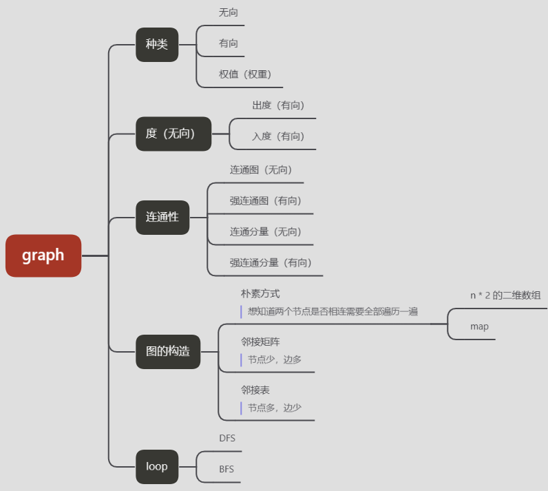

## concept




## questions

### DFS

#### [200.==岛屿数量==](https://leetcode-cn.com/problems/number-of-islands/)

```javascript {.line-numbers}
//DFS
var numIslands = function(grid) {
  const rows = grid.length
  const cols = grid[0].length
  let cnt = 0
  const dfs = (grid , i, j) => {
    if (i < 0 || i >= grid.length || j < 0 || j >= grid[0].length || grid[i][j] === '0') return
    //marked as zero, in case endless
    grid[i][j] = '0'
    dfs(grid, i + 1, j)
    dfs(grid, i, j + 1)
    dfs(grid, i - 1, j)
    dfs(grid, i, j - 1)
  }
  for (let i = 0; i < rows; i++) {
    for (let j = 0; j < cols; j++) {
      if (grid[i][j] === '1') {
        dfs(grid, i, j)
        cnt++
      }
    }
  }
  return cnt
}

//BFS
var numIslands = function (grid) {
	let ret = 0
	if (!grid || !Array.isArray(grid) || grid.length === 0) return ret
	const rows = grid.length,
		cols = grid[0].length
	for (let i = 0; i < rows; i++) {
		for (let j = 0; j < cols; j++) {
			if (grid[i][j] === '1') {
				//marked,实际不建议
				grid[i][j] = '0'
				//store each level's item
				let queue = []
				//二维转一维
				//queue.add(i * rows + j)
				queue.push([i, j])
				while (queue.length > 0) {
					const cur = queue.shift(),
						x = cur[0],
						y = cur[1]
					if (x - 1 >= 0 && grid[x - 1][y] === '1') {
						queue.push([x - 1, y])
						grid[x - 1][y] = 0
					}
					if (x + 1 < rows && grid[x + 1][y] === '1') {
						queue.push([x + 1, y])
						grid[x + 1][y] = 0
					}
					if (y - 1 >= 0 && grid[x][y - 1] === '1') {
						queue.push([x, y - 1])
						grid[x][y - 1] = 0
					}
					if (y + 1 < cols && grid[x][y + 1] === '1') {
						queue.push([x, y + 1])
						grid[x][y + 1] = 0
					}
				}
				ret++
			}
		}
	}
	return ret
}

var numIslands = function (grid) {
	let ret = 0
	if (!grid || !Array.isArray(grid) || grid.length === 0) return ret
	const rows = grid.length,
		cols = grid[0].length
  const directions = [[-1, 0], [1, 0], [0, -1], [0, 1]]
	for (let i = 0; i < rows; i++) {
		for (let j = 0; j < cols; j++) {
			if (grid[i][j] === '1') {
				//marked,实际不建议
				grid[i][j] = '0'
				//store each level's item
				let queue = []
				//二维转一维 
         //存：val = i * 常量 + j   取： i = val / const, j = val % const
         //const如何设计，要求i,j不越界, i最大m - 1,j最大n - 1
         // i * n + j 最大: (m - 1) * n + n - 1 -> m * n - 1
				//queue.add(i * rows + j)
				queue.push([i, j])
				while (queue.length > 0) {
					const cur = queue.shift(),
						x = cur[0],
						y = cur[1]
          for (let dirction of directions) {
            const newRow = x + dirction[0]
            const newCol = y + dirction[1]
            if (newRow < rows && newRow >= 0 && newCol < cols && newCol >= 0 && grid[newRow][newCol] === '1') {
              queue.push([newRow, newCol])
              grid[newRow][newCol] = '0'
            }
          }
				}
				ret++
			}
		}
	}
	return ret
}

//Union/Find Set
//init: 把每个元素所在集合初始化成其自身
//路径压缩
//按秩合并
```

#### [130.==被围绕的区域==](https://leetcode-cn.com/problems/surrounded-regions/)

```javascript {.line-numbers}
var solve = function (board) {
	//if (!board || !Array.isArray(board) || board.length === 0) return board
	const rows = board.length
	const cols = board[0].length
	const isValid = (board, i, j, rows, cols) => {
		if (
			i < 0 ||
			j < 0 ||
			i >= rows ||
			j >= cols ||
			board[i][j] === 'X' ||
			board[i][j] === '#'
		) {
			return false
		}
		return true
	}
	const dfs = (board, i, j) => {
		if (!isValid(board, i, j, board.length, board[0].length)) return
		board[i][j] = '#'
		dfs(board, i + 1, j)
		dfs(board, i - 1, j)
		dfs(board, i, j + 1)
		dfs(board, i, j - 1)
	}
	for (let i = 0; i < rows; i++) {
		for (let j = 0; j < cols; j++) {
			let isEdge = i === 0 || j === 0 || i === rows - 1 || j === cols - 1
			//from edge dfs for marking O of edge to #
			if (isEdge && board[i][j] === 'O') dfs(board, i, j)
		}
	}
	for (let i = 0; i < rows; i++) {
		for (let j = 0; j < cols; j++) {
			//Note sequence!
			if (board[i][j] === 'O') board[i][j] = 'X'
			if (board[i][j] === '#') board[i][j] = 'O'
		}
	}
}
```

#### [329.矩阵中的最长递增路径](https://leetcode.cn/problems/longest-increasing-path-in-a-matrix/)

```javascript
var longestIncreasingPath = function (matrix) {
	const dfs = (matrix, row, col) => {
		const isValid = (matrix, row, col, newRow, newCol) => {
			return (
				newRow >= 0 &&
				newRow < matrix.length &&
				newCol >= 0 &&
				newCol < matrix[0].length &&
				matrix[newRow][newCol] > matrix[row][col]
			)
		}
		let ret = 1
		for (let direction of directions) {
			const newRow = row + direction[0]
			const newCol = col + direction[1]
			if (isValid(matrix, row, col, newRow, newCol)) {
				const curRet = dfs(matrix, newRow, newCol) + 1
				ret = Math.max(ret, curRet)
			}
		}
		return ret
	}
	const rows = matrix.length
	const cols = matrix[0].length
	const directions = [
		[0, 1],
		[1, 0],
		[0, -1],
		[-1, 0],
	]
	let ret = 1
	for (let i = 0; i < rows; i++) {
		for (let j = 0; j < cols; j++) {
			const curLIP = dfs(matrix, i, j)
			ret = Math.max(ret, curLIP)
		}
	}
	return ret
}

//optimize
var longestIncreasingPath = function (matrix) {
	const dfs = (matrix, row, col) => {
		const isValid = (matrix, row, col, newRow, newCol) => {
			return (
				newRow >= 0 &&
				newRow < matrix.length &&
				newCol >= 0 &&
				newCol < matrix[0].length &&
				matrix[newRow][newCol] > matrix[row][col]
			)
		}
		longestPath[row][col] = 1
		for (let direction of directions) {
			const newRow = row + direction[0]
			const newCol = col + direction[1]
			if (isValid(matrix, row, col, newRow, newCol)) {
				const curRet = dfs(matrix, newRow, newCol) + 1
				const path = longestPath[row][col]
				longestPath[row][col] = path > curRet ? path : curRet
			}
		}
		return longestPath[row][col]
	}
	const rows = matrix.length
	const cols = matrix[0].length
	const directions = [
		[0, 1],
		[1, 0],
		[0, -1],
		[-1, 0],
	]
	//存储每个节点的LIP
	const longestPath = Array.from({ length: rows }, () =>
		new Array(cols).fill(0)
	)
	let ret = 1
	for (let i = 0; i < rows; i++) {
		for (let j = 0; j < cols; j++) {
			const curLIP = dfs(matrix, i, j)
			ret = Math.max(ret, curLIP)
		}
	}
	return ret
}
```


#### [463.岛屿的周长](https://leetcode-cn.com/problems/island-perimeter/)

```javascript {.line-numbers}
var islandPerimeter = function (grid) {
	if (!grid || !Array.isArray(grid) || grid.length === 0) return 0
	const rows = grid.length,
		cols = grid[0].length
	const dfs = (grid, i, j, rows, cols) => {
		//对应一条外边
		if (i < 0 || i >= rows || j < 0 || j >= cols) return 1
		//对应一条内边
		if (grid[i][j] === 0) return 1
		//遍历过的格子
		if (grid[i][j] !== 1) return 0
		//marked!
		grid[i][j] = 2
		return (
			dfs(grid, i + 1, j, rows, cols) +
			dfs(grid, i, j + 1, rows, cols) +
			dfs(grid, i - 1, j, rows, cols) +
			dfs(grid, i, j - 1, rows, cols)
		)
	}
	for (let i = 0; i < rows; i++) {
		for (let j = 0; j < cols; j++) {
			if (grid[i][j] === 1) {
				//题目限制只有一个岛屿
				return dfs(grid, i, j, rows, cols)
			}
		}
	}
}
```

#### [695.岛屿的最大面积](https://leetcode-cn.com/problems/max-area-of-island/)

```javascript {.line-numbers}
var maxAreaOfIsland = function (grid) {
	let ret = 0
	if (!grid || !Array.isArray(grid) || grid.length === 0) return ret
	const rows = grid.length,
		cols = grid[0].length
	const dfs = (grid, i, j, rows, cols) => {
		if (i < 0 || i >= rows || j < 0 || j >= cols || grid[i][j] !== '1') return 0
		//marked
		grid[i][j] = '2'
		return (
			1 +
			dfs(grid, i + 1, j, rows, cols) +
			dfs(grid, i, j + 1, rows, cols) +
			dfs(grid, i - 1, j, rows, cols) +
			dfs(grid, i, j - 1, rows, cols)
		)
	}
	for (let i = 0; i < rows; i++) {
		for (let j = 0; j < cols; j++) {
			if (grid[i][j] === '1') {
				//得到当次最大area
				const maxArea = dfs(grid, i, j, rows, cols)
				ret = Math.max(ret, maxArea)
			}
		}
	}
	return ret
}
```

#### [547.省份数量](https://leetcode-cn.com/problems/number-of-provinces/)

```javascript {.line-numbers}
var findCircleNum = function (M) {
	if (!M || !Array.isArray(M) || M.length === 0) return
	let len = M.length,
		visited = Array.from({ length: len }).fill(0),
		ret = 0
	let dfs = (i, M, len, visited) => {
		for (let j = 0; j < len; j++) {
			if (M[i][j] === 1 && visited[j] === 0) {
				//存在朋友圈即标注
				visited[j] = 1
				dfs(j, M, len, visited)
			}
		}
	}
	for (let i = 0; i < len; i++) {
		if (visited[i] === 0) {
			//visited[i] = 1
			dfs(i, M, len, visited)
			ret++
		}
	}
	return ret
}
```

#### [765.情侣牵手](https://leetcode.cn/problems/couples-holding-hands/)

```javascript {.line-numbers}
var minSwapsCouples = function(row) {
  const len = row.length
  let times = 0
  for (let i = 0; i < len; i += 2) {
    const A = row[i]
    //const B = x ^ 1
    const B = A % 2 === 0 ? A + 1 : A - 1
    if (row[i + 1] === B) continue
    for(let j = i + 2; j < len; j++) {
      if (row[j] === B) {
        row[j] = row[i + 1]
        row[i + 1] = B
        break
      }
    }
    times++
  }
  return times
}
```

#### [797. 所有可能的路径](https://leetcode.cn/problems/all-paths-from-source-to-target/solutions/956408/suo-you-ke-neng-de-lu-jing-by-leetcode-s-iyoh/)

```javascript
var allPathsSourceTarget = function (graph) {
	const ret = []
  const stack = []
	const dfs = (graph, x, n) => {
		if (x === n) {
			ret.push([...stack])
			return
		}
		for (let c of graph[x]) {
			stack.push(c)
			dfs(graph, c, n)
			stack.pop()
		}
	}
  stack.push(0)
	dfs(graph, 0, graph.length - 1)
	return ret
}
```

### BFS

#### [433. 最小基因变化](https://leetcode.cn/problems/minimum-genetic-mutation/)

```javascript {.line-numbers}
/*
经分析，题目要求将一个基因序列 AAA 变化至另一个基因序列 BBB，需要满足以下条件：
1. 序列 AAA 与 序列 BBB 之间只有一个字符不同
2. 变化字符只能从 A、C、G、T 中进行选择；
3. 变换后的序列 BBB 一定要在字符串数组 bank中
*/
var minMutation = function (start, end, bank) {
	const cnt = new Set()
	const visited = new Set()
	const keys = ['A', 'C', 'G', 'T']
	for (const w of bank) cnt.add(w)
	if (start === end) return 0
	if (!cnt.has(end)) return -1
	const queue = [start]
	visited.add(start)
	let step = 1
	while (queue.length) {
		const size = queue.length
		for (let i = 0; i < size; i++) {
			const cur = queue.shift()
      //loop字符的每个位置
			for (let j = 0; j < 8; j++) {
        //loop ['A', 'C', 'G', 'T']不相等则改变
				for (let k = 0; k < 4; k++) {
					if (keys[k] !== cur[j]) {
						const sb = [...cur]
						sb[j] = keys[k]
						const next = sb.join('')
						if (!visited.has(next) && cnt.has(next)) {
							if (next === end) return step
							queue.push(next)
							visited.add(next)
						}
					}
				}
			}
		}
		step++
	}
	return -1
}
```

### simulation

#### [765.情侣牵手](https://leetcode.cn/problems/couples-holding-hands/)

```javascript {.line-numbers}
var minSwapsCouples = function (row) {
	const len = row.length
	let times = 0
	for (let i = 0; i < len; i += 2) {
		const curA = row[i]
		//const curB = x ^ 1
		const curB = curA % 2 === 0 ? curA + 1 : curA - 1
		//剪枝
		if (row[i + 1] === curB) continue
		for (let j = i + 2; j < len; j++) {
			if (row[j] === curB) {
				row[j] = row[i + 1]
				row[i + 1] = curB
				break
			}
		}
		times++
	}
	return times
}

//hash优化
var minSwapsCouples = function(row) {
  const len = row.length
  let times = 0
  //提前存储每个元素的位置
  const hash = new Array(len)
  for (let i = 0; i < len; i++) hash[row[i]] = i
  for (let i = 0; i < len; i += 2) {
    const curA = row[i]
    const curB = x ^ 1
    if (row[i + 1] === curB) continue
    const bIdx = hash[curB]
    row[bIdx] = row[i + 1]
    row[i + 1] = curB
    //update hash
    hash[row[bIdx]] = bIdx
    times++
  }
  return times
}

//Union
```
