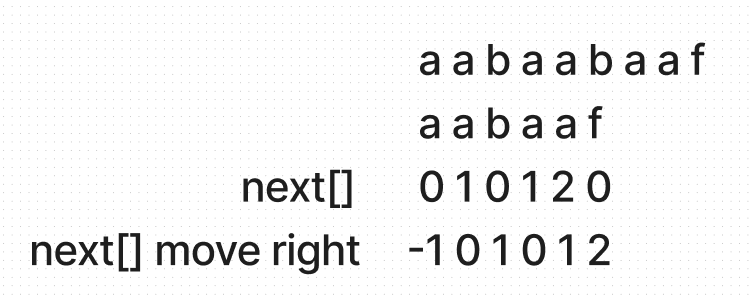

## KMP作用

当出现字符串不匹配时，可以知道一部分之前已经匹配的文本内容，可以利用这些信息避免从头再去做匹配

## 前缀&后缀

- 前缀是指不包含最后一个字符的所有以第一个字符开头的连续子串`aabaaf -> a、aa、aab、aaba、aabaa`
- 后缀是指不包含第一个字符的所有以最后一个字符结尾的连续子串`aabaaf -> f、af、aaf、baaf、abaaf`

## 前缀表（==next数组==）

- 定义：记录下标i之前（包括i）的字符串中，有多大长度的相同前缀后缀

  

- 作用：前缀表是用来回退的，它记录了模式串与主串不匹配的时候，模式串应该从哪里开始重新匹配， 主串指针不回退

## 时间复杂度分析O(m + n)

## 构造next数组(计算模式串前缀表的过程O(m))    

1. 初始化
2. 处理前后缀不相同的情况
3. 处理前后缀相同的情况，更新next

## 代码实现

```javascript
//haystack = 'aabaabaaf'
//needle = 'aabaaf'
var strStr = function (haystack, needle) {
	const needleLen = needle.length
	if (needleLen === 0) return 0
	const getNext = (needle) => {
		let next = []
		//i指向后缀末尾位置
		//j指向前缀末尾位置，也表示最长前缀的长度
		//next[i] 表示i(包括i)之前最长相等的前后缀长度(其实就是j)
		let j = 0
		next.push(j)
		for (let i = 1; i < needleLen; i++) {
			//不相等的情况,j不停回退
			while (j > 0 && needle[i] !== needle[j]) j = next[j - 1]
			//相等情况，最长相等前缀+1
			if (needle[i] === needle[j]) j++
			next.push(j)
		}
		return next
	}
	const next = getNext(needle)
	for (let i = 0, j = 0, len = haystack.length; i < len; i++) {
		while (j > 0 && haystack[i] !== needle[j]) j = next[j - 1]
		if (haystack[i] === needle[j]) j++
		if (j === needleLen) return i - needleLen + 1
	}
	return -1
}
```

```javascript
//better
const kmpSearch = (haystack, needle) => {
	const buildNext = (needle) => {
		const next = [0] //初始化
		let prefixLen = 0 //当前共同前后缀的长度
		let i = 1
		while (i < needle.length) {
			if (needle[prefixLen] === needle[i]) {
				prefixLen++
				next.push(prefixLen)
				i++
			} else {
				if (prefixLen === 0) {
					next.push(0)
					i++
				} else {
					//查表是否存在更短的前后缀
					prefixLen = next[prefixLen - 1]
				}
			}
		}
		return next
	}
	const next = buildNext(needle)
	let i = 0 //主串指针
	let j = 0 //子串指针
	while (i < haystack.length) {
		if (haystack[i] === needle[j]) {
			//字符匹配，指针后移
			i++
			j++
		} else if (j > 0) {
			// 字符匹配失败, 根据next跳过子串前面的字符
			j = next[j - 1]
		} else {
			//子串第一个字符匹配失败
			i++
		}
		//匹配成功
		if (j === needle.length) return i - j
	}
	return -1
}
```


