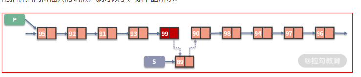
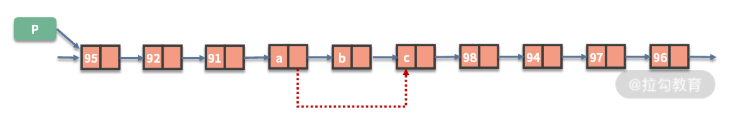

> 一个原则: 画图
> 两种题型: 指针的修改、链表的拼接
> 三个注意: 环、边界、递归
> 四个技巧: 虚拟头、快慢指针、穿针引线、先穿再排后判空
> other: 如果你想递归和迭代都写, 推荐你用前序遍历,因为前序遍历很容易改造成迭代,准确的说前序遍历容易改成不需要栈的递归,而后续遍历需要借助栈来完成
> summary: 如果是单链表,我们无法在`O(1)`的时间拿到前驱节点,这也是为什么我们遍历的时候老是维护一个前驱节点`pre`的原因。但是本质原因其实是链表的增删操作都依赖前驱节点。这是链表的基本操作,是链表的特性天生决定的

### insert & delete

- 插入

```practice
temp = 待插入位置的前驱节点.next
待插入位置的前驱节点.next = 待插入指针
待插入指针.next = temp
```



- 删除`待删除位置的前驱节点.next = 待删除位置的前驱节点.next.next`
  

### [2. 两数相加](https://leetcode-cn.com/problems/add-two-numbers/)

```javascript {.line-numbers}
var addTwoNumbers = function (l1, l2) {
	const dummyNode = new ListNode(0)
	let p1 = l1,
		p2 = l2,
		cur = dummyNode,
		carry = 0
	while (p1 !== null || p2 !== null) {
		const x = p1 !== null ? p1.val : 0
		const y = p2 !== null ? p2.val : 0
		const sum = x + y + carry
		carry = Math.floor(sum / 10)
		cur.next = new ListNode(sum % 10)
		cur = cur.next
		if (p1 !== null) p1 = p1.next
		if (p2 !== null) p2 = p2.next
	}
	//最后的进位
	if (carry === 1) {
		cur.next = new ListNode(carry)
	}
	return dummyNode.next
}
```

### [19. 删除链表的倒数第 N 个节点](https://leetcode-cn.com/problems/remove-nth-node-from-end-of-list/)

```javascript {.line-numbers}
//O(n) - O(1)
var removeNthFromEnd = function (head, n) {
	const dummyNode = new ListNode(0)
	;(dummyNode.next = head), (first = dummyNode), (second = dummyNode)

	//move first pointer so that the gap between first and second is n nodes apart
	for (let i = 1; i <= n + 1; i++) {
		first = first.next
	}
	//move first to the end, maintaining the gap
	while (first) {
		first = first.next
		second = second.next
	}
	second.next = second.next.next
	return dummyNode.next
}
```

### [21. 合并两个有序链表](https://leetcode-cn.com/problems/merge-two-sorted-lists/)

```javascript {.line-numbers}
//iteration
var mergeTwoLists = function (l1, l2) {
	const dummyNode = new ListNode(-1)
	let prev = dummyNode
	while (l1 != null && l2 != null) {
		if (l1.val < l2.val) {
			prev.next = l1
			l1 = l1.next
		} else {
			prev.next = l2
			l2 = l2.next
		}
		//move prev
		prev = prev.next
	}
	//合并后 l1 和 l2 最多只有一个还未被合并完,我们直接将链表末尾指向未合并完的链表即可
	prev.next = l1 == null ? l2 : l1
	return dummyNode.next
}

//recursion
var mergeTwoLists = function (l1, l2) {
	if (l1 == null) {
		return l2
	} else if (l2 == null) {
		return l1
	} else if (l1.val < l2.val) {
		l1.next = mergeTwoLists(l1.next, l2)
		//返回递归的头结点
		return l1
	} else {
		l2.next = mergeTwoLists(l1, l2.next)
		//返回递归的头结点
		return l2
	}
}
```

### [23. 合并 K 个排序链表](https://leetcode-cn.com/problems/merge-k-sorted-lists/)

```javascript {.line-numbers}
var mergeKLists = function (lists) {
	const len = lists.length
	if (len === 0) return null

	const arr = []
	let cur

	//add each node's val to arr
	lists.forEach((list) => {
		cur = list
		while (cur) {
			arr.push(cur.val)
			cur = cur.next
		}
	})

	const dummyNode = new ListNode(0)
	cur = dummyNode
	let node

	arr
		.sort((a, b) => a - b)
		.forEach((val) => {
			node = new ListNode(val)
			cur.next = node
			cur = cur.next
		})
	return dummyNode.next
}

//O(NlogK) - O(n) 分治
var mergeKLists = function (lists) {
	const len = lists.length
	if (len === 0) return null

	const mergeTwoLists = (l1, l2) => {
		if (!l1) return l2
		if (!l2) return l1

		if (l1.val < l2.val) {
			l1.next = mergeTwoLists(l1.next, l2)
			return l1
		} else {
			l2.next = mergeTwoLists(l1, l2.next)
			return l2
		}
	}

	const merge = (left, right) => {
		if (left === right) return lists[left]
		let mid = Math.floor((left + right) >> 1)
		let l1 = merge(left, mid)
		let l2 = merge(mid + 1, right)
		return mergeTwoLists(l1, l2)
	}
	return merge(0, len - 1)
}

//O(KN) - O(n)
var mergeKLists = function (lists) {
	const len = lists.length
	if (len === 0) return null

	const mergeTwoLists = (l1, l2) => {
		if (!l1) return l2
		if (!l2) return l1

		if (l1.val < l2.val) {
			l1.next = mergeTwoLists(l1.next, l2)
			return l1
		} else {
			l2.next = mergeTwoLists(l1, l2.next)
			return l2
		}
	}

	let ret = lists[0]
	for (let i = 1; i < len; i++) {
		ret = mergeTwoLists(ret, lists[i])
	}
	return ret
}
```

### [24. 两两交换链表](https://leetcode-cn.com/problems/swap-nodes-in-pairs/)

```javascript {.line-numbers}
//iteration, three pointer  O(n) - O(1)
var swapPairs = function (head) {
	const dummyNode = new ListNode(0)
	;(dummyNode.next = head), (cur = dummyNode)

	//够2个才换
	while (cur.next !== null && cur.next.next !== null) {
		const first = cur.next
		const second = cur.next.next

		first.next = second.next
		second.next = first
		cur.next = second
		//update cur
		cur = cur.next.next
	}
	return dummyNode.next
}

//recursion
var swapPairs = function (head) {
	//当前没有节点或者只有一个节点,不需要交换
	if (!head || !head.next) return head

	// 需要交换的两个节点是 head 和 head.next
	const first = head,
		second = head.next
	// first连接后面交换完成的子链表
	first.next = swapPairs(second.next)
	// secondNode 连接 firstNode
	second.next = first

	// 返回交换完成的子链表,second变成了头结点
	return second
}
```

### [25. K 个一组翻转链表](https://leetcode-cn.com/problems/reverse-nodes-in-k-group/) ==不熟==

```javascript {.line-numbers}
const myReverse = (head, tail) => {
	let prev = tail.next,
		p = head
	//翻转结束条件
	while (prev !== tail) {
		const nex = p.next
		p.next = prev
		prev = p
		p = nex
	}
	return [tail, head]
}

var reverseKGroup = function (head, k) {
	const dummyNode = new ListNode(0)
	dummyNode.next = head
	let pre = dummyNode

	while (head) {
		let tail = pre
		//剩余部分长度小于k则不需要反转
		for (let i = 0; i < k; ++i) {
			tail = tail.next
			if (!tail) {
				return dummyNode.next
			}
		}
		const nex = tail.next
		;[head, tail] = myReverse(head, tail)
		// 把子链表重新接回原链表
		pre.next = head
		tail.next = nex
		pre = tail
		head = tail.next
	}
	return dummyNode.next
}
```

### [61. 旋转链表](https://leetcode-cn.com/problems/rotate-list/)

```javascript {.line-numbers}
var rotateRight = function (head, k) {
	// 避免掉空和只有一个元素的情况
	if (head == null || head.next == null) return head
	let length = 1,
		cur = head
	while (cur.next) {
		cur = cur.next
		length++
	}
	//form ring
	cur.next = head
	// 因为当k大于长度时, 又是一个轮回, 所以对长度取余
	const num = k % length
	let index = 1,
		newTail = head
	//find new tail
	while (index < length - num) {
		newTail = newTail.next
		index++
	}
	//new head
	const newHead = newTail.next
	//break ring
	newTail.next = null
	return newHead
}
```

### [82. 删除排序链表中的重复元素 II](https://leetcode-cn.com/problems/remove-duplicates-from-sorted-list-ii/)

```javascript {.line-numbers}
//two pointer
var deleteDuplicates = function (head) {
	if (!head || !head.next) return head
	const dummyNode = new ListNode(-1)
	dummyNode.next = head
	let p1 = dummyNode,
		p2 = head
	while (p2 && p2.next) {
		//初始化的时p1指向的是哑结点,所以比较逻辑应该是p1的下一个节点和p2的下一个节点
		if (p1.next.val !== p2.next.val) {
			p1 = p1.next
			p2 = p2.next
		} else {
			//如果p1、p2指向的节点值相等,就不断移动p2,直到p1、p2指向的值不相等
			while (p2 && p2.next && p1.next.val === p2.next.val) p2 = p2.next
			p1.next = p2.next
			p2 = p2.next
		}
	}
	return dummyNode.next
}
```

### [83. 删除排序链表中的重复元素](https://leetcode-cn.com/problems/remove-duplicates-from-sorted-list/)

```javascript {.line-numbers}
var deleteDuplicates = function (head) {
	let cur = head
	while (cur && cur.next) {
		if (cur.next.val === cur.val) {
			cur.next = cur.next.next
		} else {
			cur = cur.next
		}
	}
	return head
}
```

### [86. 分隔链表](https://leetcode-cn.com/problems/partition-list/)

```javascript {.line-numbers}
//O(n) - O(1)
var partition = function (head, x) {
	const dummy_before = new ListNode(0),
		dummy_after = new ListNode(0)
	let before = dummy_before,
		after = dummy_after
	//build before List and after List
	while (head) {
		if (head.val < x) {
			before.next = head
			before = before.next
		} else {
			after.next = head
			after = after.next
		}
		head = head.next
	}
	after.next = null
	//link before List and after List
	before.next = dummy_after.next
	//返回链接后的头结点
	return dummy_before.next
}
```

### [92. 反转链表 II](https://leetcode-cn.com/problems/reverse-linked-list-ii/)

```javascript {.line-numbers}
var reverseBetween = function (head, m, n) {
	if (head == null) return null

	//move prev and cur to proper position
	let prev = null,
		cur = head
	while (m > 1) {
		prev = cur
		cur = cur.next
		m--
		n--
	}

	let con = prev,
		tail = cur,
		next
	while (n > 0) {
		next = cur.next
		cur.next = prev
		prev = cur
		cur = next
		n--
	}

	//handle m = 1 case
	if (con != null) {
		con.next = prev
	} else {
		head = prev
	}

	tail.next = cur
	return head
}
```

### [109. 有序链表转换二叉搜索树](https://leetcode-cn.com/problems/convert-sorted-list-to-binary-search-tree/)

```javascript {.line-numbers}
var sortedListToBST = function (head) {
	const getMedian = (left, right) => {
		let fast = (slow = left)
		while (fast !== right && fast.next !== right) {
			fast = fast.next.next
			slow = slow.next
		}
		return slow
	}

	const buildTree = (left, right) => {
		if (left === right) return null
		const mid = getMedian(left, right)
		const root = new TreeNode(mid.val)
		//左闭右开
		root.left = buildTree(left, mid)
		root.right = buildTree(mid.next, right)
		return root
	}
	//左闭右开
	return buildTree(head, null)
}
```

### [138. 复制带随机指针的链表](https://leetcode-cn.com/problems/copy-list-with-random-pointer/)

```javascript {.line-numbers}
//O(n) - O(n)
var copyRandomList = function (head) {
	const getCloneNode = (node) => {
		if (node) {
			if (visited.has(node)) {
				return visited.get(node)
			} else {
				visited.set(node, new Node(node.val, null, null))
				return visited.get(node)
			}
		}
		return null
	}

	if (!head) return null
	// Visited dictionary to hold old node reference as "key" and new node reference as the "value"
	const visited = new Map()
	let oldNode = head
	let newNode = new Node(oldNode.val)
	visited.set(oldNode, newNode)
	while (oldNode) {
		newNode.random = getCloneNode(oldNode.random)
		newNode.next = getCloneNode(oldNode.next)

		//move pointer forward,fill the attribute afterward
		oldNode = oldNode.next
		newNode = newNode.next
	}
	return visited.get(head)
}

//O(n) - O(1) 很难想出来
var copyRandomList = function (head) {
	if (!head) return null
	let ptr = head
	//A->A'->B->B'->C->C'
	while (ptr != null) {
		const newNode = new Node(ptr.val)
		newNode.next = ptr.next
		ptr.next = newNode
		ptr = newNode.next
	}
	ptr = head
	//link the random pointer
	while (ptr != null) {
		ptr.next.random = ptr.random != null ? ptr.random.next : null
		ptr = ptr.next.next
	}
	// A->B->C
	let ptrOldList = head,
		// A'->B'->C'
		ptrNewList = head.next
	const headOld = head.next
	//切断链接
	while (ptrOldList != null) {
		ptrOldList.next = ptrOldList.next.next
		ptrNewList.next = ptrNewList.next != null ? ptrNewList.next.next : null
		ptrOldList = ptrOldList.next
		ptrNewList = ptrNewList.next
	}
	return headOld
}
```

### [141. 环形链表](https://leetcode-cn.com/problems/linked-list-cycle/)

```javascript {.line-numbers}
//标记法 O(n) - O(1)
var hasCycle = function (head) {
	while (head) {
		if (head.flag) {
			return true
		} else {
			head.flag = true
			head = head.next
		}
	}
	return false
}

//fast and slow pointer O(n) - O(1)
var hasCycle = function (head) {
	let fast = (slow = head)
	while (fast && fast.next) {
		fast = fast.next.next
		slow = slow.next
		if (fast === slow) return true
	}
	return false
}
```

### [142. 环形链表](https://leetcode-cn.com/problems/linked-list-cycle-ii/)

```javascript {.line-numbers}
var detectCycle = function (head) {
	while (head) {
		if (head.flag) {
			return head
		} else {
			head.flag = true
			head = head.next
		}
	}
	return null
}
```

### [143. 重排链表](https://leetcode-cn.com/problems/reorder-list/)

```javascript {.line-numbers}
// O(n) - O(n)
var reorderList = function (head) {
	if (!head) return
	const arr = []
	let cur = head
	//add to array
	while (cur) {
		arr.push(cur)
		cur = cur.next
	}
	//rebuild ListNode
	let i = 0,
		j = arr.length - 1
	while (i < j) {
		arr[i].next = arr[j]
		i++
		//当链表个数偶数
		if (i === j) break
		arr[j].next = arr[i]
		j--
	}
	//cut the ring
	arr[i].next = null
}
```

### [206. 反转链表](https://leetcode-cn.com/problems/fan-zhuan-lian-biao-lcof/)

```javascript {.line-numbers}
//iteration
var reverseList = function (head) {
	let pre = null,
		cur = head,
		next

	while (cur) {
		//store previous next
		next = cur.next
		//change pointer ..3->2->1->null
		cur.next = pre
		//move prev forward
		pre = cur
		//move cur forward
		cur = next
	}
	//返回反转后的头结点
	return pre
}

//recursion
//返回了5这个节点
//reverseList(4)中
//p为5
//head.next.next = head 相当于 5 -> 4
//现在节点情况为 4 -> 5 -> 4
//head.next = null,切断4 -> 5 这一条,现在只有 5 -> 4 -> null
//一直返回5这个node
var reverseList = function (head) {
	if (!head || !head.next) return head
	const p = reverseList(head.next)
	//let node = head.next
	//node.next = head
	head.next.next = head
	head.next = null
	return p
}
```

### [234. 回文链表](https://leetcode-cn.com/problems/palindrome-linked-list/)

```javascript {.line-numbers}
//convert ListNode to Array O(n) - O(n)
var isPalindrome = function (head) {
	const arr = []
	while (head) {
		arr.push(head.val)
		head = head.next
	}
	for (let i = 0, j = arr.length - 1; i < j; ++i, --j) {
		if (arr[i] !== arr[j]) return false
	}
	return true
}

//O(n) - O(1)
// 找到前半部分链表的尾节点
// 反转后半部分链表
// 判断是否回文
// 恢复链表
// 返回结果
```

### [876. 链表中间节点](https://leetcode-cn.com/problems/middle-of-the-linked-list/)

```javascript {.line-numbers}
var middleNode = function (head) {
	let fast = head,
		slow = head
	while (fast && fast.next) {
		slow = slow.next
		fast = fast.next.next
	}
	return slow
}
```
