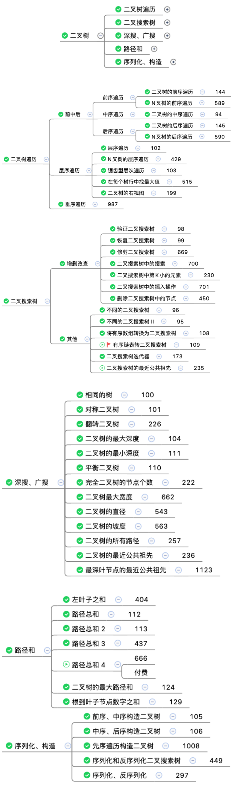

### [94.二叉树中序遍历](https://leetcode-cn.com/problems/binary-tree-inorder-traversal/)

```javascript {.line-numbers}
//recursion
var inorderTraversal = function (root) {
	let ret = []
	let traversal = (node, ret) => {
		if (!node) return
		traversal(node.left, ret)
		ret.push(node.val)
		traversal(node.right, ret)
	}
	traversal(root, ret)
	return ret
}
//iteration
var inorderTraversal = function (root) {
	const ret = [],
		stack = []

	while (root || stack.length > 0) {
		//一直放左儿子
		while (root) {
			stack.push(root)
			root = root.left
		}
		root = stack.pop()
		ret.push(root.val)
		//再放入右儿子
		root = root.right
	}
	return ret
}
```

### [98.验证二叉搜索树](https://leetcode-cn.com/problems/validate-binary-search-tree/)

```javascript {.line-numbers}
var isValidBST = function (root) {
	let helper = (node, lower, upper) => {
		if (!node) return true
		if (node.val <= lower || node.val >= upper) return false
		return (
			helper(node.left, lower, node.val) && helper(node.right, node.val, upper)
		)
	}
	return helper(root, -Infinity, Infinity)
}

var isValidBST = function (root) {
	return helper(root, null, null)

	function helper(node, min, max) {
		if (!node) return true
		if (min !== null && node.val <= min.val) return false
		if (max !== null && node.val >= max.val) return false
		//limit左子树最大值node,右子树最小值node
		return helper(node.left, min, node) && helper(node.right, node, max)
	}
}

//In-order
var isValidBST = function (root) {
	let queue = []
	let dfs = (node) => {
		if (!node) return
		node.left && dfs(node.left)
		queue.push(node.val)
		node.right && dfs(node.right)
	}
	dfs(root)
	for (let i = 0; i < queue.length; i++) {
		if (queue[i] >= queue[i + 1]) {
			return false
		}
	}
	return true
}
```

### [99.恢复二叉搜索树](https://leetcode-cn.com/problems/recover-binary-search-tree/)

```javascript {.line-numbers}
//use array
//O(n) - O(h)
var recoverTree = function (root) {
	const nums = []
	inorder(root, nums)
	const [first, second] = findTwoSwapped(nums)
	recover(root, 2, first, second)

	//inorder
	function inorder(node, nums) {
		if (node == null) return
		inorder(node.left, nums)
		nums.push(node.val)
		inorder(node.right, nums)
	}

	function findTwoSwapped(nums) {
		let x = (y = -1)
		for (let i = 0, len = nums.length; i < len; i++) {
			if (nums[i] > nums[i + 1]) {
				y = nums[i + 1]
				if (x === -1) {
					x = nums[i]
				} else {
					break
				}
			}
		}
		return [x, y]
	}

	//preorder
	function recover(root, count, x, y) {
		if (root !== null) {
			if (root.val === x || root.val === y) {
				root.val = root.val === x ? y : x
				if (--count === 0) {
					return
				}
			}
			recover(root.left, count, x, y)
			recover(root.right, count, x, y)
		}
	}
}

// O(n) - O(h)
var recoverTree = function (root) {
	let pre = (first = second = null)
	inorder(root)

	if (first !== null && second !== null) {
		;[first.val, second.val] = [second.val, first.val]
	}

	function inorder(node) {
		if (node == null) return

		inorder(node.left)

		if (pre == null) {
			pre = node
		} else {
			if (pre.val > node.val) {
				second = node
				if (first == null) {
					first = pre
				}
			}
			pre = node
		}
		inorder(node.right)
	}
}

//Morris inorder
//来到当前节点，记为cur(引用)
//1、如果cur无左孩子，cur向右移动(cur = cur.right)
//2、如果cur有左孩子，找到cur左子树上最右的节点，记为predecessor
//  (1)如果predecessor的right指针指向空，让其指向cur，cur向左移动(cur = cur.left)
//  (2)如果predecessor的right指针指向cur，说明我们已经遍历完cur的左子树,让其指向空，cur向右移动(cur = cur.right)
//  (3)重复上述操作，直至访问完整棵树
var recoverTree = function (root) {
	let first = (second = pre = predecessor = null)

	while (root !== null) {
		if (root.left) {
			predecessor = root.left
			//找到最右侧的点
			while (predecessor.right && predecessor.right !== root) {
				predecessor = predecessor.right
			}

			//继续遍历左子树
			if (predecessor.right === null) {
				predecessor.right = root
				root = root.left
				//左子树遍历完,断开链接
			} else {
				if (pre !== null && root.val < pre.val) {
					second = root
					if (first === null) {
						first = pre
					}
				}
				pre = root
				predecessor.right = null
				root = root.right
			}
			//无左孩子的情况
		} else {
			if (pre !== null && root.val < pre.val) {
				second = root
				if (first === null) {
					first = pre
				}
			}
			pre = root
			root = root.right
		}
	}

	if (first !== null && second !== null) {
		;[first.val, second.val] = [second.val, first.val]
	}
}
```

### [101.对称二叉树](https://leetcode-cn.com/problems/symmetric-tree/submissions/)

```javascript {.line-numbers}
var isSymmetric = function (root) {
	return helper(root, root)

	function helper(n1, n2) {
		if (n1 === null && n2 === null) return true
		if (n1 === null || n2 === null) return false
		return (
			n1.val === n2.val &&
			helper(n1.left, n2.right) &&
			helper(n1.right, n2.left)
		)
	}
}

var isSymmetric = function (root) {
	let queue = [root, root]
	while (queue.length) {
		const n1 = queue.shift()
		const n2 = queue.shift()
		if (n1 === null && n2 === null) continue
		if (n1 === null || n2 === null) return false
		if (n1.val !== n2.val) return false
		queue.push(n1.left, n2.right)
		queue.push(n2.left, n1.right)
	}

	return true
}
```

### [102.二叉树的层序遍历](https://leetcode-cn.com/problems/binary-tree-level-order-traversal/)

```javascript {.line-numbers}
//DFS
var levelOrder = function (root) {
	const ret = []

	const dfs = (node, level, ret) => {
		if (node == null) return
		if (!ret[level]) ret[level] = []
		ret[level].push(node.val)
		dfs(node.left, level + 1, ret)
		dfs(node.right, level + 1, ret)
	}

	dfs(root, 0, ret)
	return ret
}

//BFS iteration, use queue
//层用queue
//层用queue
//层用queue
var levelOrder = function (root) {
	if (root === null) return []

	const queue = [root],
		ret = []

	while (queue.length > 0) {
		const size = queue.length,
			curLevel = []

		for (let i = 0; i < size; i++) {
			const node = queue.shift()
			curLevel.push(node.val)
			if (node.left) queue.push(node.left)
			if (node.right) queue.push(node.right)
		}
		ret.push(curLevel)
	}
	return ret
}
```

### [104.二叉树的最大深度](https://leetcode-cn.com/problems/maximum-depth-of-binary-tree/)

```javascript {.line-numbers}
var maxDepth = function (root) {
	return root == null
		? 0
		: Math.max(maxDepth(root.left), maxDepth(root.right)) + 1
}

//dfs
var maxDepth = function (root) {
	if (!root) {
		return 0
	} else {
		let maxLeftDepth = maxDepth(root.left)
		let maxRightDepth = maxDepth(root.right)
		return Math.max(maxLeftDepth, maxRightDepth) + 1
	}
}

//bfs
var maxDepth = function (root) {
	if (root == null) {
		return 0
	}
	let queue = [root],
		ret = 0
	while (queue.length > 0) {
		let size = queue.length
		//添加当前层的所有子节点
		while (size > 0) {
			let node = queue.shift()
			if (node.left != null) {
				queue.push(node.left)
			}
			if (node.right != null) {
				queue.push(node.right)
			}
			size--
		}
		//一层添加完深度+1
		ret++
	}
	return ret
}
```

### [105.从前序与中序遍历序列构造二叉树](https://leetcode-cn.com/problems/construct-binary-tree-from-preorder-and-inorder-traversal/)

```javascript {.line-numbers}
var buildTree = function (preorder, inorder) {
	const preLen = preorder.length,
		inLen = inorder.length

	if (preLen !== inLen) throw new TypeError('invalid params')

	const map = new Map()

	//space for time
	//get inorder idx from pre value
	//note question: no same value Node, which means can form a specific tree
	for (let i = 0; i < inLen; i++) {
		map.set(inorder[i], i)
	}

	return helper(preorder, 0, preLen - 1, map, 0, inLen - 1)

	function helper(preorder, preLeft, preRight, map, inLeft, inRight) {
		if (preLeft > preRight || inLeft > inRight) return null

		const rootVal = preorder[preLeft],
			root = new TreeNode(rootVal),
			pIndex = map.get(rootVal)

		root.left = helper(
			preorder,
			preLeft + 1,
			pIndex - inLeft + preLeft,
			map,
			inLeft,
			pIndex - 1
		)
		root.right = helper(
			preorder,
			pIndex - inLeft + preLeft + 1,
			preRight,
			map,
			pIndex + 1,
			inRight
		)

		return root
	}
}
```

### [106.从中序与后序遍历序列构造二叉树](https://leetcode-cn.com/problems/construct-binary-tree-from-inorder-and-postorder-traversal/)

```javascript {.line-numbers}
var buildTree = function (inorder, postorder) {
	const inLen = inorder.length,
		postLen = postorder.length

	if (inLen !== postLen) throw new TypeError('invalid params')

	const map = new Map()

	//space for time
	//get root idx in inorder
	//note question: no same value Node, which means can form a specific tree
	for (let i = 0; i < inLen; i++) {
		map.set(inorder[i], i)
	}

	return helper(postorder, 0, postLen - 1, map, 0, inLen - 1)

	function helper(postorder, postLeft, postRight, map, inLeft, inRight) {
		if (inLeft > inRight || postLeft > postRight) return null

		const rootVal = postorder[postRight],
			root = new TreeNode(rootVal),
			pIndex = map.get(rootVal)

		root.left = helper(
			postorder,
			postLeft,
			pIndex - 1 - inLeft + postLeft,
			map,
			inLeft,
			pIndex - 1
		)
		root.right = helper(
			postorder,
			pIndex - inLeft + postLeft,
			postRight - 1,
			map,
			pIndex + 1,
			inRight
		)

		return root
	}
}
```

### [110.平衡二叉树](https://leetcode-cn.com/problems/balanced-binary-tree/)

```javascript {.line-numbers}
var isBalanced = function (root) {
	if (root === null) {
		return true
	} else {
		return (
			Math.abs(height(root.left) - height(root.right)) <= 1 &&
			isBalanced(root.left) &&
			isBalanced(root.right)
		)
	}

	function height(node) {
		if (node === null) {
			return 0
		} else {
			return Math.max(height(node.left), height(node.right)) + 1
		}
	}
}

//自底向上
var isBalanced = function (root) {
	return height(root) >= 0

	function height(node) {
		if (node === null) return 0
		let leftHeight = height(node.left)
		let rightHeight = height(node.right)
		if (
			leftHeight === -1 ||
			rightHeight === -1 ||
			Math.abs(leftHeight - rightHeight) > 1
		) {
			return -1
		} else {
			return Math.max(leftHeight, rightHeight) + 1
		}
	}
}
```

### [111.二叉树的最小深度](https://leetcode-cn.com/problems/minimum-depth-of-binary-tree/)

```javascript {.line-numbers}
//DFS
var minDepth = function (root) {
	if (root === null) return 0
	const minLeftDepth = minDepth(root.left)
	const minRightDepth = minDepth(root.right)

	return minLeftDepth === 0 || minRightDepth === 0
		? minLeftDepth + minRightDepth + 1
		: Math.min(minLeftDepth, minRightDepth) + 1
}

//BFS
var minDepth = function (root) {
	if (root === null) return 0
	const queue = [root]
	let depth = 1

	while (queue.length > 0) {
		const size = queue.length

		for (let i = 0; i < size; i++) {
			const curNode = queue.shift()
			if (curNode.left === null && curNode.right === null) {
				return depth
			}

			if (curNode.left) {
				queue.push(curNode.left)
			}

			if (curNode.right) {
				queue.push(curNode.right)
			}
		}
		depth++
	}
	return depth
}
```

### [112.路径总和](https://leetcode-cn.com/problems/path-sum/)

```javascript {.line-numbers}
var hasPathSum = function (root, sum) {
	if (root === null) {
		return false
	}

	if (root.left === null && root.right === null) {
		return root.val === sum
	}

	return (
		hasPathSum(root.left, sum - root.val) ||
		hasPathSum(root.right, sum - root.val)
	)
}
```

### [114.二叉树展开为链表](https://leetcode-cn.com/problems/flatten-binary-tree-to-linked-list/)

```javascript {.line-numbers}
var flatten = function (root) {
	if (!root) return
	flatten(root.left)
	flatten(root.right)

	//postorder
	const left = root.left
	const right = root.right

	root.left = null
	root.right = left

	//原先右子树接到当前右子树的末端
	let p = root
	while (p.right) {
		p = p.right
	}
	p.right = right
}
```

### [116.填充每个节点的下一个右侧节点指针](https://leetcode-cn.com/problems/populating-next-right-pointers-in-each-node/)

```javascript {.line-numbers}
//DFS
var connect = function (root) {
	if (!root) return null
	helper(root.left, root.right)
	return root

	function helper(node1, node2) {
		if (!node1 || !node2) return
		node1.next = node2
		helper(node1.left, node1.right)
		helper(node2.left, node2.right)
		helper(node1.right, node2.left)
	}
}

//BFS
var connect = function (root) {
	if (!root) return root

	const queue = [root]

	while (queue.length > 0) {
		const size = queue.length

		for (let i = 0; i < size; i++) {
			const node = queue.shift()
			//connect
			if (i < size - 1) {
				node.next = queue[0]
			}

			if (node.left) queue.push(node.left)
			if (node.right) queue.push(node.right)
		}
	}

	return root
}
```

### [124.二叉树中的最大路径和](https://leetcode-cn.com/problems/binary-tree-maximum-path-sum/)

```javascript {.line-numbers}
//dfs_post traversal
var maxPathSum = function (root) {
	let retMax = Number.MIN_SAFE_INTEGER

	const dfs = (node) => {
		if (node == null) return 0
		//if negative, then return 0 to outerSum
		let left = Math.max(dfs(node.left), 0)
		let right = Math.max(dfs(node.right), 0)

		const innerSum = left + right + node.val
		//update innerSum
		retMax = Math.max(retMax, innerSum)
		return Math.max(left, right) + node.val
	}
	dfs(root)
	return retMax
}
```

### [144.二叉树前序遍历](https://leetcode-cn.com/problems/binary-tree-preorder-traversal/)

```javascript {.line-numbers}
//recursion, don't need to judge if node is null
var preorderTraversal = function (root) {
	const ret = []
	const traversal = (node, ret) => {
		if (!node) return
		ret.push(node.val)
		traversal(node.left, ret)
		traversal(node.right, ret)
	}
	traversal(root, ret)
	return ret
}

//iteration. use stack
var preorderTraversal = function (root) {
	const ret = [],
		stack = []
	root && stack.push(root)

	while (stack.length > 0) {
		root = stack.pop()
		ret.push(root.val)
		if (root.right) {
			stack.push(root.right)
		}
		if (root.left) {
			stack.push(root.left)
		}
	}
	return ret
}
```

### [145.二叉树后序遍历](https://leetcode-cn.com/problems/binary-tree-postorder-traversal/)

```javascript {.line-numbers}
//recursion
var postorderTraversal = function (root) {
	let ret = []
	var traversal = (node) => {
		if (!node) return
		traversal(node.left)
		traversal(node.right)
		ret.push(node.val)
	}
	traversal(root)
	return ret
}

//iteration
//节点第一次访问时并不打印，而是在第二次遍历时才打印。所以需要一个变量来标记该结点是否访问过
const postorderTraversal = (root) => {
	const ret = [],
		stack = []
	let prev = null

	while (root || stack.length > 0) {
		//一直放左儿子
		while (root) {
			stack.push(root)
			root = root.left
		}
		root = stack.pop()
		//root.right === prev 节点访问过一次
		if (!root.right || root.right === prev) {
			ret.push(root.val)
			prev = root
			root = null
		} else {
			//再次放入
			stack.push(root)
			root = root.right
		}
	}

	return ret
}

//逆序输出
const postorderTraversal = (root) => {
	const ret = [],
		stack = []

	root && stack.push(root)
	while (stack.length > 0) {
		root = stack.pop()
		//unshift顺序从根左右 => 右左根
		ret.unshift(root.val)

		//右左根 => 左右根
		if (root.left !== null) {
			stack.push(root.left)
		}
		if (root.right !== null) {
			stack.push(root.right)
		}
	}
	return ret
}
```

### [199.二叉树的右视图](https://leetcode-cn.com/problems/binary-tree-right-side-view/)

```javascript {.line-numbers}
//recursion
var rightSideView = function (root) {
	const ret = []
	const dfs = (node, level, ret) => {
		if (!node) return
		if (level === ret.length) ret.push(node.val)
		//visit right son first, so above line code can visit right first node of next level
		dfs(node.right, level + 1, ret)
		dfs(node.left, level + 1, ret)
	}

	dfs(root, 0, ret)
	return ret
}

//use queue
var rightSideView = function (root) {
	if (!root) return []
	const ret = [],
		queue = [root]

	while (queue.length > 0) {
		const size = queue.length
		for (let i = 0; i < size; i++) {
			const node = queue.shift()
			if (node.left) queue.push(node.left)
			if (node.right) queue.push(node.right)
			if (i === size - 1) ret.push(node.val)
		}
	}
	return ret
}
```

### [222.完全二叉树的节点个数](https://leetcode-cn.com/problems/count-complete-tree-nodes/)

```javascript {.line-numbers}
var countNodes = function (root) {
	let l = (r = root),
		hl = (hr = 0)
	while (l) {
		l = l.left
		hl++
	}

	while (r) {
		r = r.right
		hr++
	}

	if (hl === hr) {
		return Math.pow(2, hl) - 1
	}

	return 1 + countNodes(root.left) + countNodes(root.right)
}

//bad version
var countNodes = function (root) {
	if (root === null) return 0
	const left = countLevel(root.left)
	const right = countLevel(root.right)

	// 如果满二叉树的层数为h，则总节点数为：2^h - 1
	// 左子树一定是满二叉树，因为节点已经填充到右子树了，左子树必定已经填满了。所以左子树的节点总数我们可以直接得到，是 2^left - 1，加上当前这个 root 节点，则正好是 2^left。再对右子树进行递归统计
	if (left === right) {
		return countNodes(root.right) + (1 << left)
		//说明此时最后一层不满，但倒数第二层已经满了，可以直接得到右子树的节点个数。同理，右子树节点加上root节点，总数为 2^right。再对左子树进行递归查找
	} else {
		return countNodes(root.left) + (1 << right)
	}

	function countLevel(node) {
		let level = 0
		while (node) {
			level++
			node = node.left
		}
		return level
	}
}
```

### [226.翻转二叉树](https://leetcode-cn.com/problems/invert-binary-tree/)

```javascript {.line-numbers}
//preorder or postorder
var invertTree = function (root) {
	if (!root) return null
	const left = invertTree(root.left)
	const right = invertTree(root.right)
	root.left = right
	root.right = left
	return root
}

var invertTree = function (root) {
	if (!root) return root
	const queue = [root]

	while (queue.length > 0) {
		const cur = queue.shift()
		;[cur.left, cur.right] = [cur.right, cur.left]

		if (cur.left) queue.push(cur.left)
		if (cur.right) queue.push(cur.right)
	}
	return root
}
```

### [230.寻找第 K 小的元素](https://leetcode-cn.com/problems/kth-smallest-element-in-a-bst/)

```javascript {.line-numbers}
var kthSmallest = function (root, k) {
	let rank = 0,
		ret = 0
	helper(root, k)
	return ret

	function helper(node, k) {
		if (!node) return
		helper(node.left, k)
		if (++rank === k) {
			ret = node.val
			return
		}
		helper(node.right, k)
	}
}
```

### [235.二叉搜索树的公共祖先](https://leetcode-cn.com/problems/lowest-common-ancestor-of-a-binary-search-tree/)

```javascript {.line-numbers}
var lowestCommonAncestor = function (root, p, q) {
	while (root) {
		if (root.val > p.val && root.val > q.val) root = root.left
		else if (root.val < p.val && root.val < q.val) root = root.right
		else return root
	}
}
```

### [236.二叉树的最近公共祖先](https://leetcode-cn.com/problems/lowest-common-ancestor-of-a-binary-tree/)

```javascript {.line-numbers}
var lowestCommonAncestor = function (root, p, q) {
	if (root === null || root === p || root === q) return root
	let left = lowestCommonAncestor(root.left, p, q)
	let right = lowestCommonAncestor(root.right, p, q)
	return left === null ? right : right === null ? left : root
}

var lowestCommonAncestor = function (root, p, q) {
	if (root === null) return null
	if (root === p || root === q) return root

	const left = lowestCommonAncestor(root.left, p, q)
	const right = lowestCommonAncestor(root.right, p, q)

	//postorder 从下往上走
	if (left !== null && right !== null) return root

	if (left === null && right === null) return null

	return left === null ? right : left
}
```

### [297.二叉树的序列化与反序列化](https://leetcode-cn.com/problems/serialize-and-deserialize-binary-tree/)

```javascript {.line-numbers}
const serialize = (root) => {
	if (root == null) {
		return 'X'
	}
	const left = serialize(root.left) // 左子树的序列化结果
	const right = serialize(root.right) // 右子树的序列化结果
	return root.val + ',' + left + ',' + right // 按  根,左,右  拼接字符串
}

const deserialize = (data) => {
	const list = data.split(',')

	const buildTree = (list) => {
		const rootVal = list.shift()
		if (rootVal == 'X') {
			// 是X，返回null节点
			return null
		}
		const root = new TreeNode(rootVal)
		root.left = buildTree(list) // 递归构建左子树
		root.right = buildTree(list) // 递归构建右子树
		return root // 返回当前构建好的root
	}
	return buildTree(list) // 构建的入口
}
```

### [429.N 叉树的层序遍历](https://leetcode-cn.com/problems/n-ary-tree-level-order-traversal/)

```javascript {.line-numbers}
//DFS
var levelOrder = function (root) {
	var nums = []

	let traversal = (node, level, nums) => {
		if (!node) return
		if (!nums[level]) nums[level] = []
		nums[level].push(node.val)
		for (var i = 0; i < node.children.length; i++) {
			traversal(node.children[i], level + 1, nums)
		}
	}
	traversal(root, 0, nums)
	return nums
}

//BFS use queue
var levelOrder = function (root) {
	if (!root) return []
	let queue = [root]
	let ret = []
	while (queue.length) {
		let curLevel = [],
			size = queue.length
		for (let i = 0; i < size; i++) {
			let current = queue.shift()
			curLevel.push(current.val)
			if (current.children && current.children.length) {
				queue.push(...current.children)
			}
		}
		ret.push(curLevel)
	}
	return ret
}
```

### [450.删除二叉搜索树中的节点](https://leetcode-cn.com/problems/delete-node-in-a-bst/)

```javascript {.line-numbers}
var deleteNode = function (root, key) {
	if (root == null) return null
	if (root.val == key) {
		// 这两个 if 把情况 1 和 2 都正确处理了
		if (root.left == null) return root.right
		if (root.right == null) return root.left
		// 处理情况 3
		const minNode = getMin(root.right)
		root.val = minNode.val
		root.right = deleteNode(root.right, minNode.val)
	} else if (root.val > key) {
		root.left = deleteNode(root.left, key)
	} else if (root.val < key) {
		root.right = deleteNode(root.right, key)
	}
	return root

	function getMin(node) {
		// BST 最左边的就是最小的
		while (node.left != null) node = node.left
		return node
	}
}
```

### [515.在每个树行中找最大值](https://leetcode-cn.com/problems/find-largest-value-in-each-tree-row/)

```javascript {.line-numbers}
//dfs
var largestValues = function (root) {
	const ret = []
	const dfs = (node, level, ret) => {
		if (!node) return
		//hole!!! node's value maybe null
		//hole!!! node's value maybe null
		//hole!!! node's value maybe null
		if (ret[level] === undefined) ret[level] = node.val
		ret[level] = Math.max(ret[level], node.val)
		dfs(node.left, level + 1, ret)
		dfs(node.right, level + 1, ret)
	}

	dfs(root, 0, ret)
	return ret
}

//bfs
var largestValues = function (root) {
	const ret = []
	if (!root) return ret
	const queue = [root]

	while (queue.length > 0) {
		const size = queue.length,
			max = -Infinity
		for (let i = 0; i < size; i++) {
			const node = queue.shift()
			if (node.left) queue.push(node.left)
			if (node.right) queue.push(node.right)
			max = Math.max(max, node.val)
		}
		ret.push(max)
	}
	return ret
}
```

### [538.把二叉搜索树转换为累加树](https://leetcode-cn.com/problems/convert-bst-to-greater-tree/)

```javascript {.line-numbers}
//倒序遍历节点
var convertBST = function (root) {
	let sum = 0
	const traversal = (node) => {
		if (!node) return null
		traversal(node.right)
		sum += node.val
		node.val = sum
		traversal(node.left)
	}

	traversal(root)
	return root
}
```

### [543.二叉树的直径](https://leetcode-cn.com/problems/diameter-of-binary-tree/)

```javascript {.line-numbers}
var diameterOfBinaryTree = function (root) {
	let ret = 1
	dfs(root)
	return ret - 1

	function dfs(node) {
		if (!node) return 0
		const leftDepth = dfs(node.left)
		const rightDepth = dfs(node.right)
		ret = Math.max(ret, leftDepth + rightDepth + 1)
		return Math.max(leftDepth, rightDepth) + 1
	}
}
```

### [589.N 叉树的前序遍历](https://leetcode-cn.com/problems/n-ary-tree-preorder-traversal/)

```javascript {.line-numbers}
var preorder = function (root) {
	let ret = []
	const traversal = (node, ret) => {
		if (!node) return
		ret.push(node.val)
		if (node.children && node.children.length > 0) {
			node.children.forEach((child) => {
				traversal(child, ret)
			})
		}
	}

	traversal(root, ret)
	return ret
}

//iteration
var preorder = function (root) {
	const ret = [],
		stack = [root]

	while (stack.length > 0) {
		const node = stack.pop()
		if (node) {
			ret.push(node.val)
			//preorder need push right son first
			for (let i = node.children.length - 1; i >= 0; i--) {
				stack.push(node.children[i])
			}
		}
	}
	return ret
}
```

### [590.N 叉树的后序遍历](https://leetcode-cn.com/problems/n-ary-tree-postorder-traversal/)

```javascript {.line-numbers}
//recursion
var postorder = function (root) {
	const ret = [],
		stack = []

	const postorderNode = (node, ret) => {
		if (!node) return
		node.children.forEach((child) => {
			postorderNode(child, ret)
		})
		ret.push(node.val)
	}
	postorderNode(root, ret)
	return ret
}

//iteration
var postorder = function (root) {
	const ret = [],
		stack = [root]

	while (stack.length > 0) {
		const node = stack.pop()

		if (node) {
			//左右根
			for (let i = 0; i < node.children.length; i++) {
				stack.push(node.children[i])
			}
			ret.unshift(node.val)
		}
	}
	return ret
}
```

### [652.寻找重复的子树](https://leetcode-cn.com/problems/find-duplicate-subtrees/)

```javascript {.line-numbers}
var findDuplicateSubtrees = function (root) {
	const map = new Map(),
		ret = []

	const traversal = (node) => {
		if (!node) return '#'

		const left = traversal(node.left)
		const right = traversal(node.right)

		const subTree = `${left},${right},${node.val}`
		if (map.has(subTree)) {
			if (map.get(subTree) === 1) {
				ret.push(node)
			}
			map.set(subTree, map.get(subTree) + 1)
		} else {
			map.set(subTree, 1)
		}

		return subTree
	}

	traversal(root)
	return ret
}
```

### [654.最大二叉树](https://leetcode-cn.com/problems/maximum-binary-tree/)

```javascript {.line-numbers}
var constructMaximumBinaryTree = function (nums) {
	if (!nums || nums.length === 0) return nums
	return build(nums, 0, nums.length - 1)

	function build(nums, low, high) {
		if (low > high) return null
		let index = -1,
			max = Number.MIN_SAFE_INTEGER
		for (let i = low; i <= high; i++) {
			if (nums[i] > max) {
				max = nums[i]
				index = i
			}
		}
		let root = new TreeNode(max)
		root.left = build(nums, low, index - 1)
		root.right = build(nums, index + 1, high)

		return root
	}
}
```

### [662.二叉树最大宽度](https://leetcode-cn.com/problems/maximum-width-of-binary-tree/)

```javascript {.line-numbers}
//not AC
//not AC
//not AC
//如果我们走向左子树，那么 position -> position * 2，如果我们走向右子树，那么 position -> position * 2 + 1。当我们在看同一层深度的位置值 L 和 R 的时候，宽度就是 R - L + 1
var widthOfBinaryTree = function (root) {
	let ret = 0
	const map = new Map()
	dfs(root, 0, 0)
	return ret

	function dfs(node, depth, position) {
		if (!node) return
		if (!map.has(depth)) map.set(depth, position)
		ret = Math.max(ret, position - map.get(depth) + 1)
		dfs(node.left, depth + 1, position * 2)
		dfs(node.right, depth + 1, position * 2 + 1)
	}
}
```

### [700.二叉搜索树中的搜索](https://leetcode-cn.com/problems/search-in-a-binary-search-tree/)

```javascript {.line-numbers}
var searchBST = function (root, val) {
	if (!root) return null
	if (root.val === val) {
		return root
	} else if (root.val > val) {
		return searchBST(root.left, val)
	} else {
		return searchBST(root.right, val)
	}
}
```

### [701.二叉搜索树中的插入操作](https://leetcode-cn.com/problems/insert-into-a-binary-search-tree/)

```javascript {.line-numbers}
var insertIntoBST = function (root, val) {
	if (!root) return new TreeNode(val)
	if (root.val < val) {
		root.right = insertIntoBST(root.right, val)
	} else if (root.val > val) {
		root.left = insertIntoBST(root.left, val)
	}
	return root
}
```

### [987.二叉树的垂序遍历](https://leetcode-cn.com/problems/vertical-order-traversal-of-a-binary-tree/)

```javascript {.line-numbers}
var verticalTraversal = function (root) {
	if (!root) return []

	// 二维数组 存坐标和值，形式如 [[x, y, val], [...]]
	let locations = []

	const dfs = function (root, x, y) {
		if (!root) return
		locations.push([x, y, root.val])
		dfs(root.left, x - 1, y - 1)
		dfs(root.right, x + 1, y - 1)
	}
	// 先前序遍历记录下节点坐标和值
	dfs(root, 0, 0)

	// 按照x升序，y降序，val升序
	locations = locations.sort((a, b) => {
		if (a[0] !== b[0]) {
			return a[0] - b[0]
		}
		if (a[1] !== b[1]) {
			return b[1] - a[1]
		}
		return a[2] - b[2]
	})

	// curValOfX当前遍历的节点的x的值，默认先取第一个节点的x值
	let curValOfX = locations[0][0]
	const ret = [[locations[0][2]]]

	// 从第2个节点开始遍历坐标数组，把x相同的val分成一组
	for (let i = 1; i < locations.length; i++) {
		const location = locations[i]
		const x = location[0]
		if (x === curValOfX) {
			const last = ret[ret.length - 1]
			last.push(location[2])
		} else {
			curValOfX = x
			ret.push([location[2]])
		}
	}
	return ret
}
```
